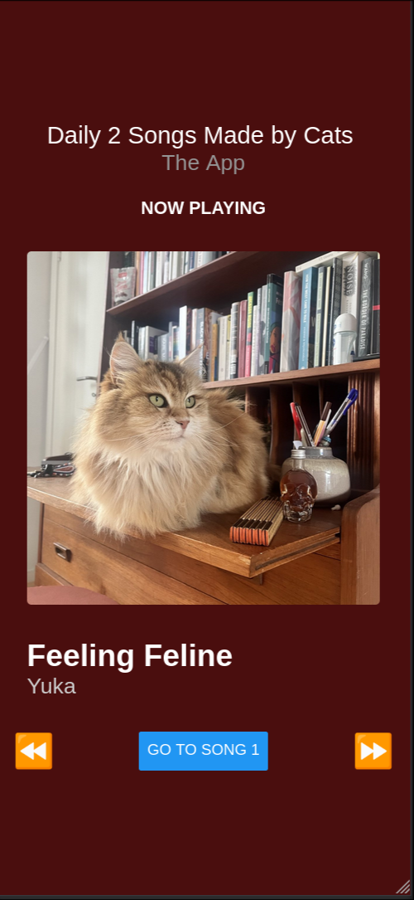
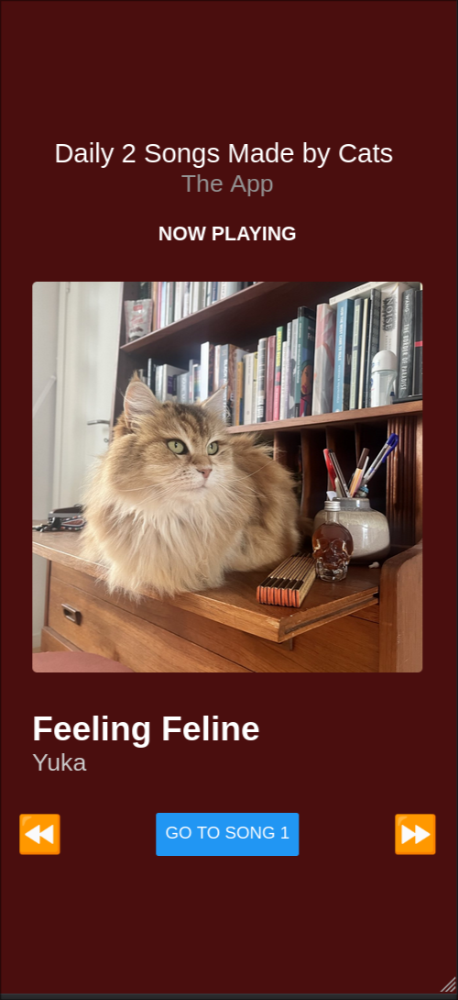
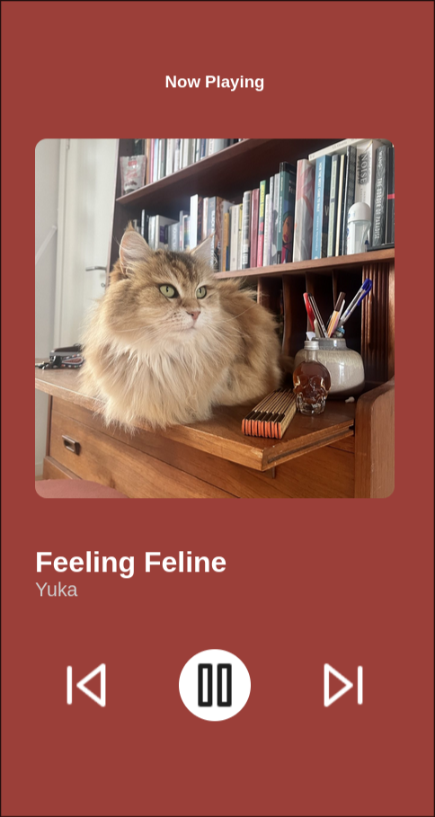
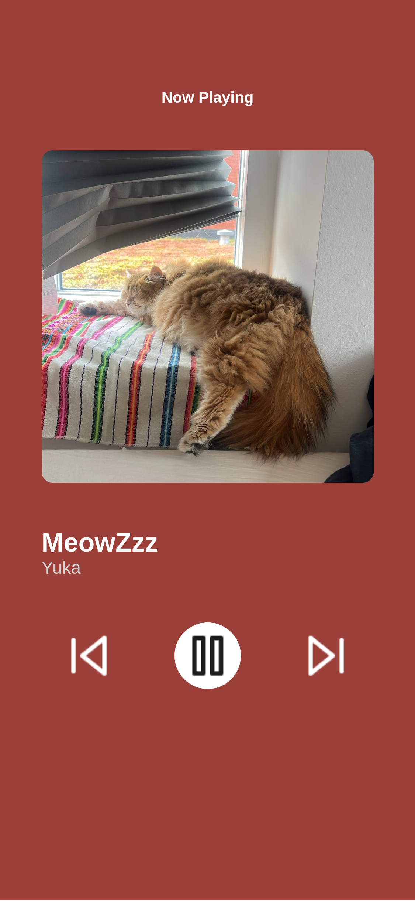

# Assignment 1 

## Practical Information

- This is an individual assignment
- There will be no supervision for this assignment, only written feedback

### Dates

Introduced: 17th of February

Deadline:

### How to submit
Each student should submit a `.zip` folder with all the files of the app and a one-page text file (preferably pdf or .txt) with a link to the Figma design file that contains the designs.

## Description

The goal of this assignment is for you to create a one-screen application prototype with at least one interactive component coded in React Native. It's design and style must be based on a Figma design that you have also created. 

The app is a music/podcast player. The screen you must design is the screen where the user sees what is currently playing. The protoype must look similar to this screen from the Spotify music player:

OBS: Please note that "similar" is used to describe your design. It is not expected that you create a perfect copy of the design, though you can try as much as you can.  See below for some examples of how the one-screen app can look like.

## Design and Technical Requirements 

### Technical Requirements 

The one-screen application must include at least one of the following components:

**Introduced in Session 2:**
- `<View>`
- `<Text>`  
- `<Image>`
- StyleSheet

**Introduced in Session 3 and 4**:
- `<Pressable>` **or** `<Button>`

### Design Requirements

- The image provided is an example, you can re-design the screen as you see fit or just stick to the Spotify look. 
  - If you your own design, it should still be the design for a music player app
- It is perfectly fine that the React Native application doesn't look exactly like the Figma design
- You can change, add or remove buttons
  - For example: 
    - Changing the icon on the lower left with a like button. 
    - Getting rid of all icons that are not related to music.
- The background **<u>must</u> be one solid color**
- You can ignore the `About the artist` part at the bottom of the screen
- The artist, album cover, and song don't have to be real
- If the "progress bar" is giving you trouble, skip it or design a new one
- Using emojis such as "▶️⏩🔀" is allowed if you are having trouble finding assets for your design

### `<Pressable>` or `<Button>` use

- These are the components you will use to make part of your app interactive
- You can choose the "easier" route with `<Button>` or use `<Pressable>` for more control of the design of the button.
- There is no specific requirement for what the interaction should be, however, it is expected that it somewhat follows the logic of what a streaming app or music player would do.
- Below in the examples, you can find some ideas and suggestions on how to implement the interactive component
- That said, if you want to do something different, it's also fine!

## Examples of Prototypes with the Minimum Requirements

### Interaction with `<Button>`

This prototype images an app where two songs are streamed to the users daily. The user can change theoretically song and rewind the song. However, only the change song interaction is implemented. The interactive `<Button>` changes the following elements:
  - Album Cover 
  - Song Name

### Interaction with `<Pressable>`

This prototype is more like a typical music player. The interaction in this case is possible through the `<Pressable>` component, which is applied to the ⏮️ and ⏭️ buttons. The interaction is the same as above, it changes the song. The following elements change:
  - Album Cover
  - Song Name

## Template Code

I have prepared a template that you can use to start, it can be download on LearnIT, or [clicking here](linkkkkk)

