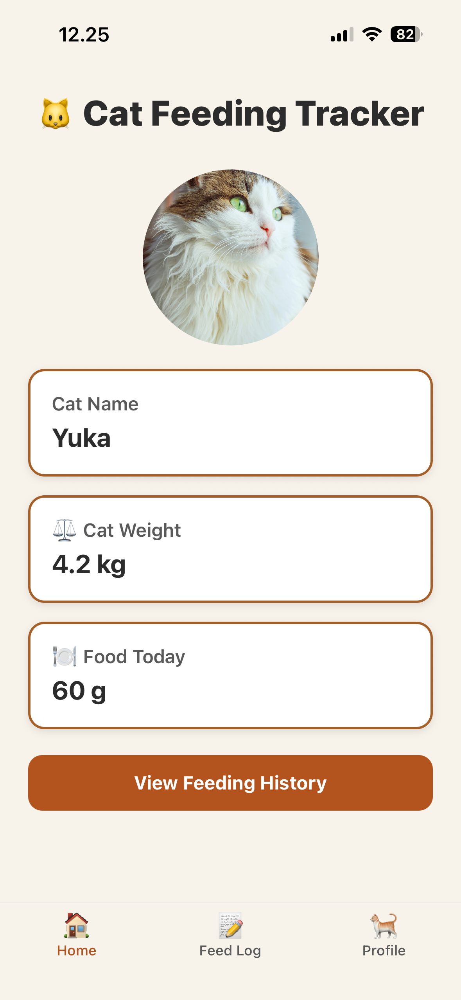
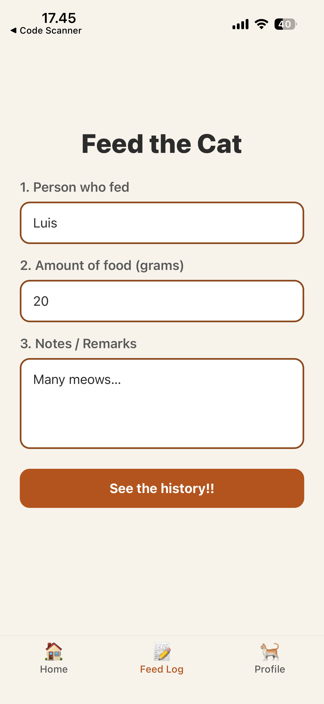
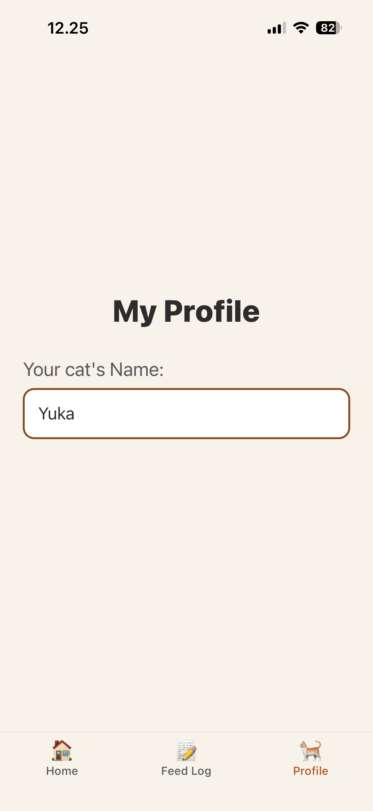
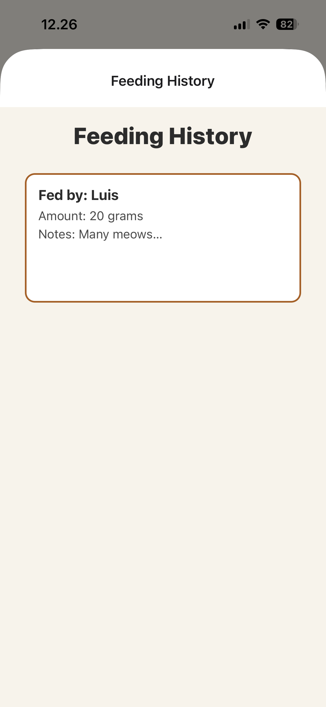
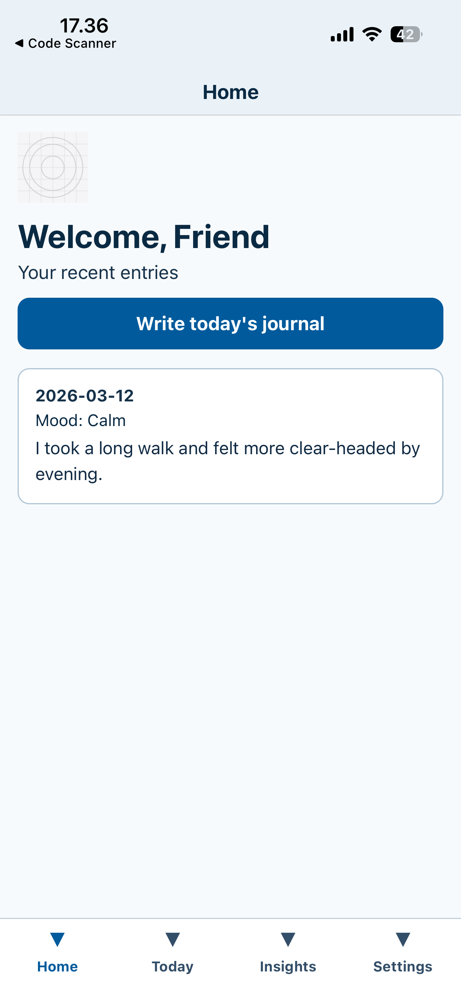
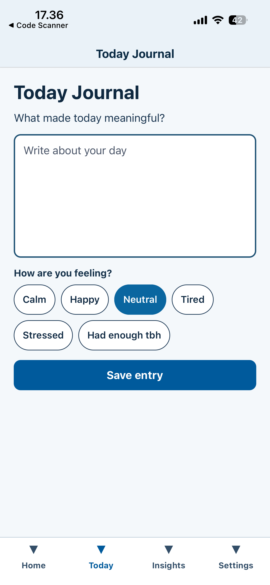
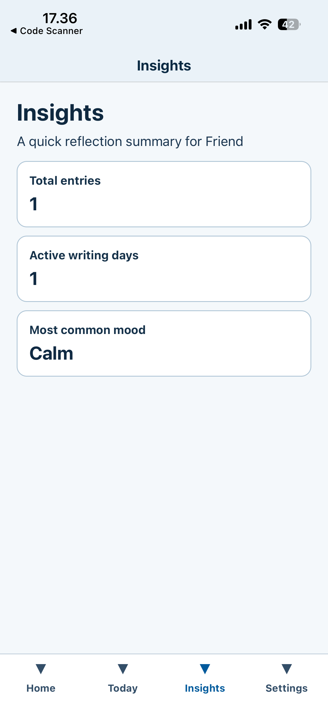
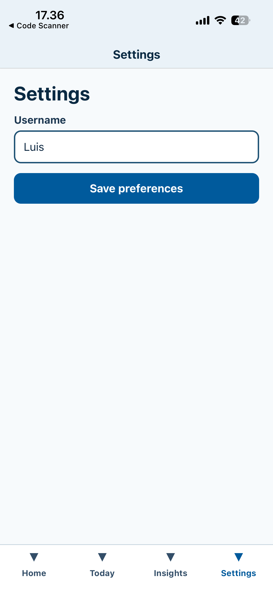
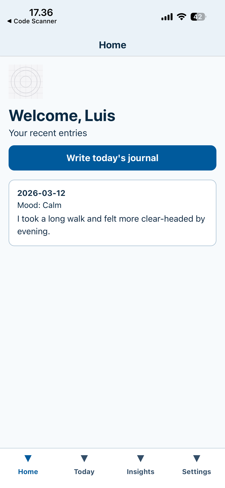

# Assignment 2 

**Table of Contents**

- [Assignment 2](#assignment-2)
  - [Relation of Assignment #2 to your Exam](#relation-of-assignment-2-to-your-exam)
  - [Practical Information](#practical-information)
    - [Dates](#dates)
    - [How to Submit Your Assignment](#how-to-submit-your-assignment)
    - [File Submission Checklist](#file-submission-checklist)
  - [Description of Assignment](#description-of-assignment)
    - [Theme Option 1: Open theme](#theme-option-1-open-theme)
    - [Theme Option 2: Select a theme from the list below](#theme-option-2-select-a-theme-from-the-list-below)
  - [Design, Accesibility and Technical Requirements](#design-accesibility-and-technical-requirements)
    - [Design Requirements](#design-requirements)
    - [Accesibility Requirements](#accesibility-requirements)
    - [Minimum Technical Requirements](#minimum-technical-requirements)
      - [Minimum Number of Screens](#minimum-number-of-screens)
      - [Static Components](#static-components)
      - [Interactive Components](#interactive-components)
  - [Examples of Prototypes with the Minimum Requirements](#examples-of-prototypes-with-the-minimum-requirements)
    - [Example 1: Open Theme Prototype](#example-1-open-theme-prototype)
    - [Example 2: Journal App Prototype](#example-2-journal-app-prototype)
      - [Example 2: Screens](#example-2-screens)
      - [Example 2: Data sharing](#example-2-data-sharing)
  - [Template Code](#template-code)

<!-- /code_chunk_output -->

## Relation of Assignment #2 to your Exam
- Your exam will require you to submit a reflection on both assignments
- The reflections can be about:
  - The translation from Figma design to React Native code
  - The progression in complexity from having one screen to multiple screens
  - The implementation of accesibility as a requirement for your assignment/exam
- Each assignment's reflection will be 0.5 pages, making it a total of 1 page in the exam
- **Tip**: keep notes on learnings and challenges when doing the two assignments

## Practical Information

- This is a <u>group</u> assignment
- You feedback for this assignment will be in the form of a supervision meeting
    - During this supervision we will discuss your submission, but it will also be mainly targeted towards the exam
    - If you have submitted alone because you are already experienced with React Native, the supervision/meeting can be about any other topic that interests you in relation to mobile applications and the exam. 
- This assignment is meant to get you coding the base of what will become your exam, however, it is not a requirement that your exam is the same theme as your assignment #2

### Dates

Introduced: 17th of March

Deadline: 10th of April

### How to Submit Your Assignment

Each group must submit a `.zip` file containing a folder with the files of the app and a one-page text file (preferably .pdf or .txt) with a link to the Figma design file on which the code is based.

If you are unsure of how to make a `.zip` file, or your `.zip` file is taking too long to be made/uploaded. Please follow the <u>**[file submission guide](https://github.com/luuislanda/PMA2026/tree/main/guides/submission-guide)**</u>

To obtain a link to your figma design, you can follow the guide [here.](https://help.figma.com/hc/en-us/articles/360040531773-Share-files-and-prototypes)

### File Submission Checklist

Here is the checklist for the files that must be submitted for this assignment:

- [ ] The folder with your working code
  - [ ] App.js
  - [ ] app.json
  - [ ] assets (folder)
    - [ ] any assets you've added
  - [ ] index.js
  - [ ] package_lock.json
  - [ ] package.json
  - [ ] screens (folder)
    - [ ] all your screen `.js` files
- [ ] text file (.txt or .pdf) with links to Figma files

## Description of Assignment

The goal of this assignment is for you to create a prototype with at least four (4) screens that are compliant with the A level of the WCAG 2.2 guidelines for accesibility. Data must be shared across at least 2 of these screens. Like the previous assignment, the UI and styling must be based on a Figma design file which you will also submit. 

Similar to the previous assignment, it is **not** expected that your prototype will look _exactly_ like the Figma design you've shared. However, there should be a clear similarity between them.

As for the theme of the app/prototype, you have two options.

### Theme Option 1: Open theme
If you choose option 1, the app/prototype can be (almost) anything. It just has to be a prototype of an "app" and conform to the minimal requirements set below. 

In practice, this means this can be a health care app, a podcast app, a journal app, a dictionary, pretty much anything.

Though it is open, you have a few restrictions. This is mainly because if you choose any of the choices below, it will be technically unfeasible for you, given what we have seen so far in the course.

You are not allowed to make:
- Games or anything that requires some advanced backend processing
- Any app that requires "real time" collaboration
- Apps for media (audio,photo,video) editing
- A cat/pet feeding app

> **‼️OBS: If you go for an open theme, it's entirely up to you how much time you spend in the ideation/conceptualisation part of your prototype. 

> The course and the ILOs clearly state this is a course about **hands-on programming of mobile applications.** You will _not_ be evaluated on the concept of your app‼️

### Theme Option 2: Select a theme from the list below

If you find the open theme intimidating, pick one of the apps themes below for your assignment:

- Podcast/Music Player
- Local sports club
- Journal 
- To-do / task organiser

## Design, Accesibility and Technical Requirements 

### Design Requirements

You must make a design file that contains all screens in Figma.

There is no other requirement for Figma in this assignment. 

### Accesibility Requirements

The prototype must be compliant with the WCAG's A level. Additionally, the requirement for contrast in colours from the WCAG must also be met.

Concretely the prototype's code must have:

- An `accessibilityLabel` prop on every meaningful `<Image>` component, providing a text description of the image for screen readers.
- `accessibilityRole="header"` on the main header `<View>` or `<Text>` of each screen, so screen readers can identify the heading hierarchy.
- An `accessibilityLabel` on any `<View>` that conveys information through colour or visual cues alone (e.g. a coloured status indicator), describing the full meaning in text.
- `accessibilityRole="button"` and an `accessibilityHint` on every `<TouchableOpacity>` and `<Pressable>` that triggers an action.
- `accessibilityRole="text"`, `accessibilityLabel`, and `accessibilityHint` on every `<TextInput>`.
- A `tabBarAccessibilityLabel` on every `<Tab.Screen>` in the `BottomTabNavigator`.
- No element that relies **only** on colour to convey information — all status indicators, warnings, or highlights must also include a text or symbol equivalent.

### Minimum Technical Requirements 

#### Minimum Number of Screens

- 4 Screens
  - You must use a `BottomTabNavigator` as the main navigation of your prototype
  - If you wish you can also use Stack navigation, though it is **_not required_**

#### React Native Components and Functions

At least one of each of these components/functions:

- `<View>`
- `<Text>`  
- `<Image>`
- `StyleSheet`
- `useState`
- `<Pressable>`
- `<TouchableOpacity>`
- `<TextInput>`
- `createBottomTabNavigator` from React Navigation

Your prototype _must_ be able to share data/variables across at least two screens. 

For example, if your application has a screen for settings where the user is able to input their name, the name must appear in the homescreen. See the example below for more details.

## Examples of Prototypes with the Minimum Requirements

### Example 1: Open Theme Prototype

A cat feeding tracker application.

In this example, which we built in class, we can see multiple instances of data being "shared" across screens.

1. Screen 3's "Enter your cat name" `<TextInput>` can be seen in Screen 1
2. Screen 2's data can be seen in Screen 4

Screen 1

Screen 2

Screen 3

Screen 4

### Example 2: Journal App Prototype

This prototype shows a Journal Application where the user is expected to write diary entries.

It has 4 screens, all using the `BottonTabNavigator`. 

#### Example 2: Screens

Screen 1

Screen 2

Screen 3

Screen 4

#### Example 2: Data sharing

In this prototype, the variable for `Username` from Screen 4 is shared with Screen 1.

If we change the text in Screen 4:

It will appear in Screen 1:

## Template Code

I have prepared a template that you can use to start, it already has the routing for 4 screens and a `BottomTabNavigator`, it can be download on LearnIT, or [clicking here](). 

Feel free to repurporse any code you've written or seen in the course so far.

Good luck and if you have any questions, reach out to me via email or during class.