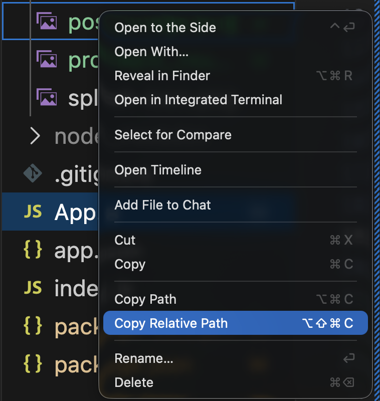

# Cheatsheet

Over the course of the semester, this page will be updated with tips and tricks of things you will use a lot. If you would like to contribute feel free to send a pull request!


- [Cheatsheet](#cheatsheet)
  - [Project Set Up](#project-set-up)
    - [Setting Up a New Project](#setting-up-a-new-project)
  - [React Native Components](#react-native-components)
    - [`<View>`](#view)
      - [Syntax](#syntax)
      - [Props](#props)
    - [`<Text>`](#text)
      - [Syntax](#syntax-1)
      - [Props](#props-1)
    - [`<Image />`](#image-)
      - [Syntax](#syntax-2)
      - [Props](#props-2)
      - [Online vs local files](#online-vs-local-files)
        - [Online Images](#online-images)
        - [Local Images](#local-images)
    - [`<Button />`](#button-)
      - [Syntax](#syntax-3)
      - [Props](#props-3)
    - [`Alert` function](#alert-function)
      - [Parameters](#parameters)
    - [`<ScrollView>`](#scrollview)
      - [Syntax](#syntax-4)
      - [Props](#props-4)
    - [`<Pressable>`](#pressable)
      - [Syntax](#syntax-5)
      - [Props](#props-5)
    - [`<TouchableOpacity>`](#touchableopacity)
      - [Syntax](#syntax-6)
      - [Props](#props-6)
    - [`<TextInput />`](#textinput-)
      - [Syntax](#syntax-7)
      - [Props](#props-7)
  - [StyleSheet](#stylesheet)
    - [Syntax](#syntax-8)
    - [Example](#example)
    - [Some commonly used properties](#some-commonly-used-properties)
  - [Flexbox](#flexbox)
    - [Syntax](#syntax-9)
    - [Quick Figma Comparison](#quick-figma-comparison)
  - [React Native Hooks](#react-native-hooks)
    - [`useState`](#usestate)
      - [Syntax](#syntax-10)
      - [How to use](#how-to-use)
      - [Parts](#parts)
    - [`useNavigation`](#usenavigation)
      - [Syntax](#syntax-11)
      - [How to navigate](#how-to-navigate)
  - [Navigation](#navigation)
    - [Bottom Tab Navigation](#bottom-tab-navigation)
      - [Syntax](#syntax-12)
      - [`<Tab.Navigator>` screenOptions](#tabnavigator-screenoptions)
      - [`<Tab.Screen>` options](#tabscreen-options)
    - [Stack Navigation (NativeStack)](#stack-navigation-nativestack)
      - [Syntax](#syntax-13)
      - [`<Stack.Screen>` options](#stackscreen-options)

<!-- /code_chunk_output -->


## Project Set Up

### Setting Up a New Project

Here's how I recommend you go about starting your projects.

0. Open VSCode and click on `Open`
1. Using that navigator, create a folder for this project, we'll call it "Session 2"
2. Click on `Open` and then say you trust the authors
3. On the top menu, go to `Terminal` and then click on `New Terminal`
4. Once it's open, we can run the commands from the guide in exercise 1

`npx create-expo-app@latest --template blank .`

5. After a minute or so, everything is set up. Now, run the final command:

`npm start`

6. Scan the QR code with your phone (if you haven't yet download the Expo Go App for your phone)

7. If connecting your phone to the computer is giving you trouble, [you can follow this troubleshooting guide](https://github.com/luuislanda/PMA2026/tree/main/troubleshooting)

## React Native Components

React Native components always start with a Capital Letter.

### `<View>`

The View is the most fundamental building block. It acts as a container or wrapper, similar to a "Frame" in Figma. It is used to group other components together, apply layout settings via Flexbox, and provide visual styling like background colors and borders.

`<View>` can have children!

#### Syntax

```js
<View style={styles.container}>
{/* Other components go here */}
</View> //Important to close the tag!
```

#### Props

| Prop          | Purpose                                   | Requirement | Expects                |
|---------------|-------------------------------------------|-------------|------------------------|
| style         | Controls layout, spacing, and background. | Optional    | Object: styles.name    |
| pointerEvents | Defines if the view responds to touches.  | Optional    | String: 'none', 'auto' |
| accessible         | Ensures the view is included in the accessibility tree so assistive technologies can interact with it. | Optional    | Boolean: true / false  |
| accessibilityRole  | Defines the semantic role of the view for screen readers (e.g. marks it as a header).                | Optional    | String: 'header', 'none' |
| accessibilityLabel | A text description read aloud by screen readers when the view is focused.                            | Optional    | String: ""             |

### `<Text>`

In React Native, you cannot place a raw string of text directly inside a container. All text must be wrapped in a Text component. 

It supports nesting meanign it can have children (but only for other `<Text>` components) and handles typography settings like font size, weight, and letter spacing.

#### Syntax

```js
<Text style={styles.label}>
Your text content here
</Text>
```

#### Props

| Prop          | Purpose                                     | Requirement | Expects               |
|---------------|---------------------------------------------|-------------|-----------------------|
| style         | Controls typography and font settings.      | Optional    | Object: styles.name   |
| numberOfLines | Limits text to a specific amount of lines.  | Optional    | Number: 2             |
| selectable         | Allows the user to highlight and copy text.                                                          | Optional    | Boolean: true / false |
| accessibilityRole  | Marks the text element with a semantic role for screen readers, e.g. as a heading.                   | Optional    | String: 'header', 'text' |

### `<Image />`

This component is used to display images from local files, the app's asset folder, or a network URL. Unlike design software, if you are loading an image from the web, you must explicitly define its width and height in the style prop, or it will not appear.

Image cannot have children! So it is a **self-closing** component

#### Syntax

```js
<Image 
  source={require('./assets/local-icon.png')} 
  style={styles.localIcon} 
/> // This is how you end the tag of a self closing component!
```


#### Props 

| Prop       | Purpose                                      | Requirement | Expects                    |
|------------|----------------------------------------------|-------------|----------------------------|
| source     | The path or URL of the image file.           | Required    | require() or {uri: ''}     |
| style      | Must define Width and Height for web images. | Required    | Object: styles.name        |
| resizeMode | How the image scales to fit its frame.       | Optional    | String: 'cover', 'contain' |
| blurRadius         | Applies a Gaussian blur to the image.                                                                | Optional    | Number: 10                 |
| accessibilityLabel | A text description of the image read aloud by screen readers. Use this for all meaningful images.    | Optional    | String: ""                 |


#### Online vs local files

Depending on whether the image you want to use is online, or in your local folder, the `<Image>` component props will be different.

##### Online Images

For online images, the source `prop` must be accompanied by a `uri` and the link to the image

```js
<Image 
  source={{
    uri: 'https://upload.wikimedia.org/wikipedia/commons/5/53/Sheba1.JPG', 
  }}
/>
```

##### Local Images

For offline images (and assets in general), you must specify the _path_ to your image.

The _path_ can be easily obtain in VSCode by going to the folder where your image is, right clicking and then selecting `Copy Relative Path`



Once you have that, you paste it into your code. However, you will notice that what you paste is as follows:

`assets/post_image.png` which is not how React Native likes it's relative paths. This is easily solved by adding a `./` at the beginning of the path you just coppied.

The final result will look like this:

```js
<Image 
    source={require("./assets/post_image.png")}
/>
```

For more information about paths, [here is a good article explaining them](https://www.freecodecamp.org/learn/responsive-web-design-v9/lecture-working-with-links/what-is-the-difference-between-absolute-and-relative-paths). However, bear in mind that it's a guide for the web, and that most programming languages (and even operating systems) have their own way to handle relative paths

### `<Button />`

A simple, self-closing component for handling user taps. It renders using the native button styles of the underlying platform (iOS or Android), meaning it will look slightly different on each device. 

It is useful for quick actions but is limited in custom visual styling. `<Button />` cannot have children and therefore is a **self-closing** component.

#### Syntax

```js
<Button 
  title="Submit" 
  onPress={() => console.log('Button pressed')} 
  color="#007AFF"
/>
```

#### Props

| Prop     | Purpose                                     | Requirement | Expects                 |
|----------|---------------------------------------------|-------------|-------------------------|
| title    | The text displayed on the button.           | Required    | String: ""Click Me""    |
| onPress  | The function to run when tapped.            | Required    | Function: () =>         |
| color    | iOS: Text color. Android: Background color. | Optional    | String: 'red' or '#hex' |
| disabled | Greys out the button and stops interaction. | Optional    | Boolean: true / false   |

### `Alert` function

Alert is not a component; it is an API (a function) that triggers a native system dialog. 

It is used to provide feedback, confirm an action, or show an error. Because it uses the native OS dialog, it will look like a standard iOS alert on an iPhone and a Material Design dialog on Android.

#### Parameters

| Argument | Purpose                                     | Requirement | Expects                   |          |                       |
|----------|---------------------------------------------|-------------|---------------------------|----------|-----------------------|
| Title    | The bold heading at the top of the pop-up.  | Required    | String: ""Warning""       |          |                       |
| Message  | The smaller body text explaining the alert. | Optional    | String: ""Are you sure?"" |          |                       |

### `<ScrollView>`

`<ScrollView>` works exactly like a `<View>` but adds the ability to scroll through its contents. It is great for prototypes and screens with a non-huge amount of content.

`<ScrollView>` can have children!

#### Syntax

```js
<ScrollView style={styles.scrollContainer}>
  {/* Other components go here */}
</ScrollView>
```

#### Props

| Prop                  | Purpose                                                    | Requirement | Expects               |
|-----------------------|------------------------------------------------------------|-------------|-----------------------|
| style                 | Controls layout, spacing, and background of the container. | Optional    | Object: styles.name   |
| contentContainerStyle | Styles applied to the inner scroll content wrapper.        | Optional    | Object: styles.name   |
| horizontal            | Enables horizontal scrolling instead of vertical.          | Optional    | Boolean: true / false |
| accessibilityLabel    | A description of the scroll area read aloud by screen readers.                                       | Optional    | String: ""            |

### `<Pressable>`

A flexible wrapper for adding touch interactions. Unlike `<Button />`, `<Pressable>` can wrap any component (images, text, icons, etc.) and be styled freely. It behaves like a `<View>`, meaning all of its children become pressable.

`<Pressable>` can have children!

#### Syntax

```js
<Pressable
  onPress={() => Alert.alert('Pressed!')}
  style={styles.button}
>
  <Text>Press Me</Text>
</Pressable>
```

#### Props

| Prop        | Purpose                                            | Requirement | Expects             |
|-------------|----------------------------------------------------|-----------  |---------------------|
| onPress     | Called immediately when the user taps the element. | Required    | Function: () => {}  |
| style       | Controls layout and visuals (just like a View).    | Optional    | Object: styles.name |
| onLongPress        | Triggers logic if the user holds down the press.                                                     | Optional    | Function: () => {}  |
| accessibilityRole  | Identifies the interactive element to screen readers.                                                | Optional    | String: 'button'    |
| accessibilityLabel | A clear description of what the pressable element does.                                              | Optional    | String: ""          |
| accessibilityHint  | Additional context about what happens when the element is pressed.                                   | Optional    | String: ""          |

### `<TouchableOpacity>`

Very similar to `<Pressable>`, but includes a built-in fade animation every time the user presses it. It is particularly useful for buttons and any interactive element where visual feedback is important.

`<TouchableOpacity>` can have children!

#### Syntax

```js
<TouchableOpacity
  onPress={() => navigation.navigate('History')}
  style={styles.button}
>
  <Text style={styles.buttonText}>View History</Text>
</TouchableOpacity>
```

#### Props

| Prop          | Purpose                                                         | Requirement | Expects             |
|---------------|-----------------------------------------------------------------|-------------|---------------------|
| onPress       | Called immediately when the user taps the element.              | Required    | Function: () => {}  |
| style         | Controls layout and visuals.                                    | Optional    | Object: styles.name |
| activeOpacity      | How transparent the element becomes when pressed (0.0 to 1.0).                                       | Optional    | Number: 0.2         |
| accessibilityRole  | Identifies the interactive element to screen readers.                                                | Optional    | String: 'button'    |
| accessibilityLabel | A clear description of what the button does.                                                         | Optional    | String: ""          |
| accessibilityHint  | Additional context about what happens when the element is pressed.                                   | Optional    | String: ""          |

### `<TextInput />`

Allows the user to type text into the app via the keyboard. It cannot have children and is therefore a **self-closing** component. It must be paired with a `useState` declaration to capture and display the typed text.

#### Syntax

```js
<TextInput
  style={styles.input}
  placeholder="Type here..."
  value={inputValue}
  onChangeText={setInputValue}
/>
```

#### Props

| Prop               | Purpose                                                           | Requirement | Expects                         |
|--------------------|-------------------------------------------------------------------|-------------|---------------------------------|
| style              | Controls layout, fonts, and border styling.                       | Optional    | Object: styles.name             |
| placeholder        | Displays temporary grayed-out text before the user starts typing. | Optional    | String: ""                      |
| value              | The current text displayed in the input field.                    | Required    | String (state variable)         |
| onChangeText       | A function called every time the user types or deletes a character.| Required   | Function: setter from useState  |
| accessibilityRole  | Tells screen readers the purpose of the element.                  | Optional    | String: 'text'                  |
| accessibilityLabel | A clear description of the input for screen readers.              | Optional    | String: ""                      |
| accessibilityHint  | Additional guidance on how to interact with the element.          | Optional    | String: ""                      |

## StyleSheet

StyleSheet is an abstraction similar to CSS that allows you to define styles away from the render function. It is the standard way to style components in React Native. 

It usually lives at the bottom of the code.

### Syntax

```js
const styles = StyleSheet.create({
  layerName: {
    property: value,
  },
});
```

### Example

```js
const styles = StyleSheet.create({
  container: {
    flex: 1,
    justifyContent: 'center',
    alignItems: 'center',
    backgroundColor: '#f5f5f5',
  },
  title: {
    fontSize: 24,
    color: '#333',
  },
});
```

### Some commonly used properties

| Property Group | Purpose                                         | Common Values                                      |
|----------------|-------------------------------------------------|----------------------------------------------------|
| Flexbox        | Controls how items are distributed and aligned. | flex, flexDirection, justifyContent, alignItems    |
| Spacing        | Controls distance inside and outside the frame. | padding, margin, paddingVertical, marginHorizontal |
| Borders        | Controls the stroke and corner radius.          | borderWidth, borderColor, borderRadius             |
| Positioning    | Manages layers relative to their parents.       | position: 'absolute', top, bottom, left, right     |

## Flexbox

Flexbox is the engine React Native uses to handle layout. Instead of placing elements at fixed X and Y coordinates, Flexbox allows you to stack items and distribute space dynamically. 

This is the programmatic version of Auto-Layout in Figma. It ensures that your UI adapts correctly to different screen sizes, from a small iPhone SE to a large Android tablet.

### Syntax

Flexbox properties are defined within the StyleSheet and applied to a <View> in this example.

```js
const styles = StyleSheet.create({
  layoutFrame: {
    flex: 1,                // Component fills its parent
    flexDirection: 'row',   // Sets the direction of the stack
    justifyContent: 'center', // Aligns items along the main axis
    alignItems: 'center',     // Aligns items along the cross axis
  },
});
```

### Quick Figma Comparison

| Figma Setting            | React Native Property | Possible Values                                                     |
|--------------------------|-----------------------|---------------------------------------------------------------------|
| Direction: Vertical      | flexDirection         | 'column' (Default)                                                  |
| Direction: Horizontal    | flexDirection         | 'row'                                                               |
| Distribution (Main Axis) | justifyContent        | 'flex-start', 'center', 'flex-end', 'space-between', 'space-around' |
| Alignment (Cross Axis)   | alignItems            | 'flex-start', 'center', 'flex-end', 'stretch'                       |
| Gap (Item Spacing)       | gap                   | Number (e.g., 12)                                                   |
| Padding                  | padding               | Number (e.g., 16)                                                   |
| Padding (Left/Right)     | paddingHorizontal     | Number (e.g., 20)                                                   |
| Padding (Top/Bottom)     | paddingVertical       | Number (e.g., 10)                                                   |
| Sizing: Fill Container   | flex                  | 1                                                                   |
| Sizing: Hug Contents     | (No flex property)    | Define specific width or height or let content dictate size.        |

## React Native Hooks

Hooks are special functions that give your components extra abilities, like memory or navigation. They always start with the word `use`.

### `useState`

`useState` is a hook that gives your component a "memory." Every time its value is updated via the setter function, React automatically re-renders the screen to reflect the change.

Always define `useState` in the **JS Zone**, before the `return` statement.

#### Syntax

```js
const [state, setState] = useState(initialValue)
```

#### How to use

**Step 0:** Import at the top of your file:

```js
import { useState } from 'react';
```

**Step 1:** Declare in the JS Zone with an initial value:

```js
const [currentOrder, setCurrentOrder] = useState('No orders yet...');
```

**Step 2:** Use the setter inside a handling function:

```js
const handleOrder = (dish) => {
  setCurrentOrder('Cooking ' + dish);
};
```

**Step 3:** Use the state variable in the JSX Zone:

```js
<Text>{currentOrder}</Text>
```

#### Parts

| Part           | Purpose                                                              |
|----------------|----------------------------------------------------------------------|
| `state`        | The current value, displayed on screen.                              |
| `setState`     | The setter function that updates the value and triggers a re-render. |
| `initialValue` | The starting value of the state (e.g., `''`, `0`, `false`).         |

### `useNavigation`

`useNavigation` is a hook that gives any component inside a screen the ability to navigate to other screens. Add it to your **screen files** (e.g., `HomeScreen.js`), not to `App.js`.

#### Syntax

```js
import { useNavigation } from '@react-navigation/native';

// Inside your screen component:
const navigation = useNavigation();
```

#### How to navigate

```js
// Navigate to another main tab screen
navigation.navigate('Profile')

// Navigate to a screen inside the same stack
navigation.navigate('History')

// Navigate from one tab to a screen inside another tab's stack
navigation.navigate('Home', { screen: 'History' })
```

## Navigation

React Native uses the `@react-navigation` library for all navigation. Before using any navigator, install the required packages:

```
npm install @react-navigation/native
npx expo install react-native-screens react-native-safe-area-context
npm install @react-navigation/bottom-tabs
npm install @react-navigation/native-stack
```

### Bottom Tab Navigation

The industry-standard bottom bar that persists across all screens. Ideal as the main navigation skeleton of your app.

#### Syntax

```js
import { NavigationContainer } from '@react-navigation/native';
import { createBottomTabNavigator } from '@react-navigation/bottom-tabs';

const Tab = createBottomTabNavigator();

export default function App() {
  return (
    <NavigationContainer>
      <Tab.Navigator
        screenOptions={{
          headerShown: false,
          tabBarActiveTintColor: '#000',
        }}
      >
        <Tab.Screen
          name="Home"
          component={HomeScreen}
          options={{
            title: 'Home',
            tabBarIcon: () => <Text>🏠</Text>,
            tabBarAccessibilityLabel: 'Home tab',
          }}
        />
        <Tab.Screen
          name="Profile"
          component={ProfileScreen}
          options={{
            title: 'Profile',
            tabBarIcon: () => <Text>👤</Text>,
            tabBarAccessibilityLabel: 'Profile tab',
          }}
        />
      </Tab.Navigator>
    </NavigationContainer>
  );
}
```

#### `<Tab.Navigator>` screenOptions

| Property                | Purpose                                                             | Expects                          |
|-------------------------|---------------------------------------------------------------------|----------------------------------|
| initialRouteName        | Which screen displays first when the app loads.                     | String (matches a screen name)   |
| headerShown             | Toggles the navigation header bar at the top.                       | Boolean: true / false            |
| tabBarActiveTintColor   | Color of the icon and label for the currently selected tab.         | String: 'red' or '#hex'          |
| tabBarInactiveTintColor | Color of the icons and labels for all non-selected tabs.            | String: 'red' or '#hex'          |
| tabBarStyle             | Styles the bottom bar container (background, height, etc.).         | Object (StyleSheet)              |
| tabBarLabelStyle        | Styles the text labels under the icons (font size, weight, etc.).   | Object (StyleSheet)              |

#### `<Tab.Screen>` options

| Property                 | Purpose                                                  | Expects                      |
|--------------------------|----------------------------------------------------------|------------------------------|
| title                    | The visible text label under the tab icon.               | String                       |
| tabBarIcon               | The graphic (emoji, image) representing the tab.         | Function: () => component    |
| tabBarAccessibilityLabel | Text read aloud by screen readers to identify the tab.   | String                       |

### Stack Navigation (NativeStack)

Stacks screens on top of each other like a deck of cards, perfect for drill-down flows within a tab. The stack is initialised inside `App.js` and wrapped in a function to keep things organised.

#### Syntax

```js
import { createNativeStackNavigator } from '@react-navigation/native-stack';

const HomeStack = createNativeStackNavigator();

function HomeStackScreen() {
  return (
    <HomeStack.Navigator>
      <HomeStack.Screen
        name="HomeMain"
        component={HomeScreen}
        options={{ title: 'Home', headerShown: false }}
      />
      <HomeStack.Screen
        name="History"
        component={HistoryScreen}
        options={{ title: 'History', headerShown: true, presentation: 'modal', animation: 'slide_from_bottom' }}
      />
    </HomeStack.Navigator>
  );
}

// Then pass HomeStackScreen to the Tab.Navigator as a component:
// <Tab.Screen name="Home" component={HomeStackScreen} />
```

#### `<Stack.Screen>` options

| Property     | Purpose                                                    | Expects                              |
|--------------|------------------------------------------------------------|--------------------------------------|
| title        | The text shown in the navigation header.                   | String                               |
| headerShown  | Toggles the header at the top of the screen.               | Boolean: true / false                |
| presentation | Defines how the screen appears over the previous one.      | String: 'modal', 'card'              |
| animation    | Controls the animation used when the screen slides in.     | String: 'slide_from_bottom', 'fade'  |
