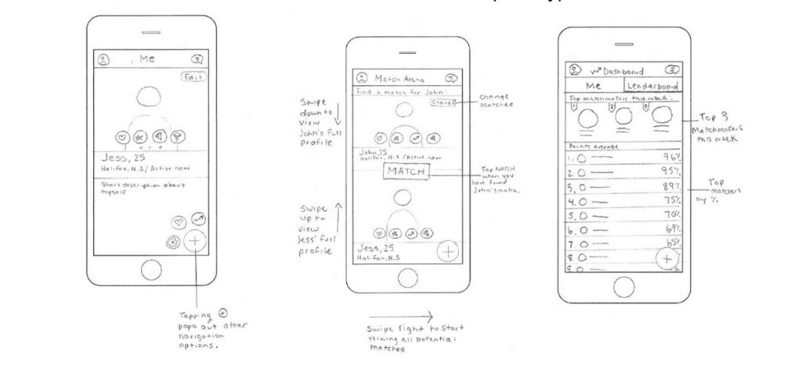
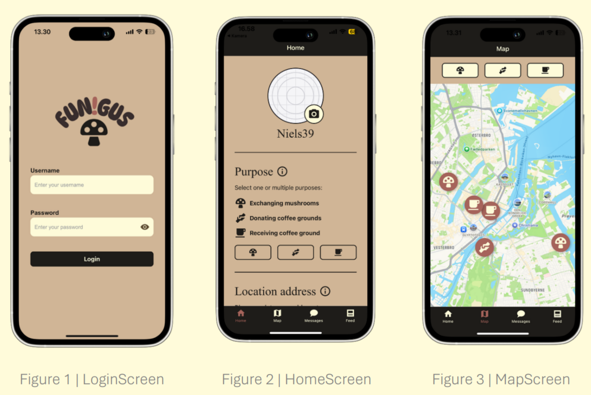
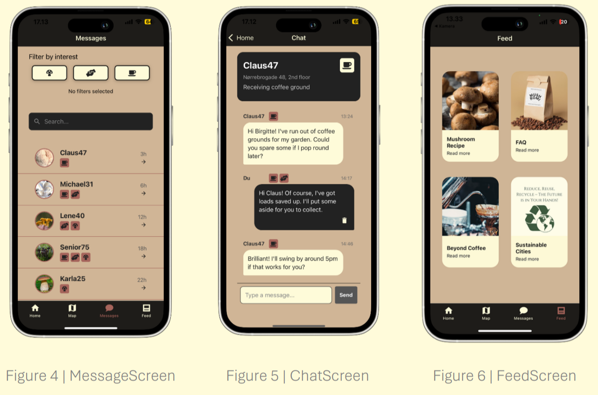
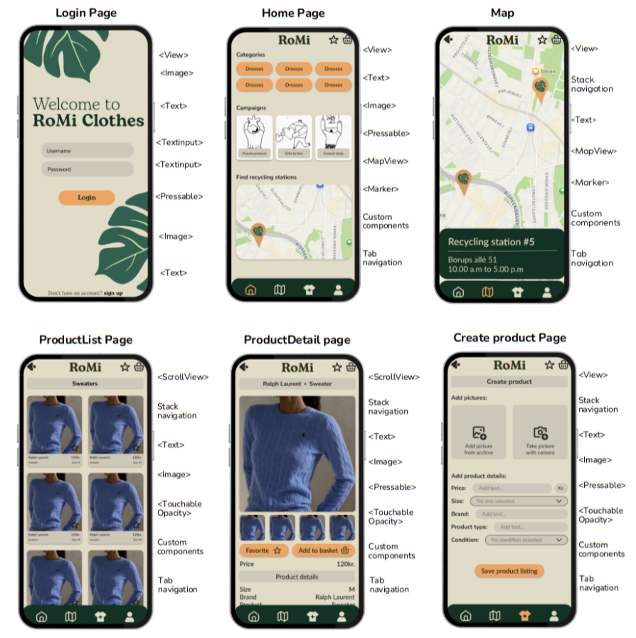
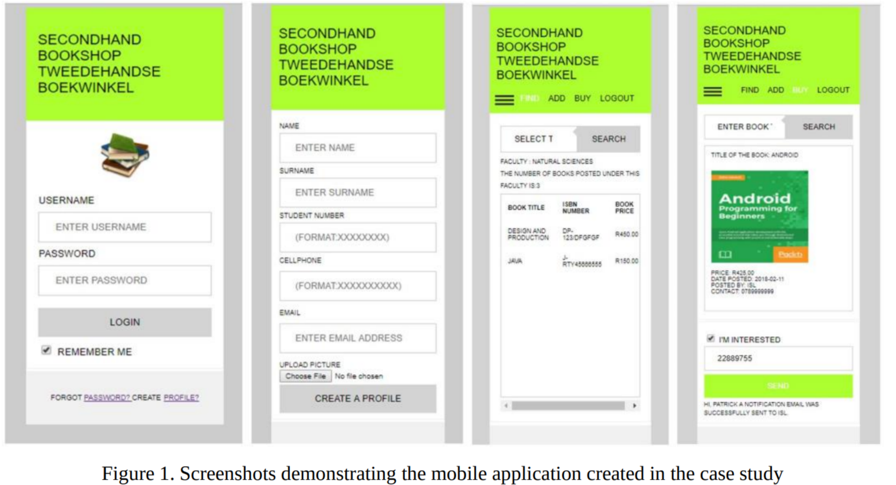
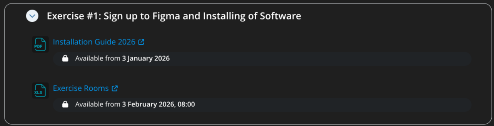

# Programming Mobile Applications

Session 1: Course and Subject Introduction

  <a href="https://github.com/slidevjs/slidev" target="_blank" alt="GitHub" title="Open in GitHub"
    class="text-xl slidev-icon-btn opacity-50 !border-none !hover:text-white">
    <carbon-logo-github />
  </a>

<!--
Welcome!
-->

---
layout: default
hideInToc: true
---

# Table of Contents

<Toc maxDepth="1"></Toc>

---
layout: two-cols-header

---

# The Teaching Team

## TAs

::left::

Louise

Stavros

::right::

Tao

Veronika

---
hideInToc: true
layout: image-right
image: ./assets/imgs/luis.webp
backgroundSize: 20rem
---

## Your teacher and course manager (me)

- Work for the _Technologies in Practice_ & _Data, Systems and Robotics_ sections at ITU
- Currently working in a solar server project on ITU's roof
- Not a designer... more of an infrastructure IT person
- Ex data scientist, I prefer to teach and the social aspect of education
- I have taught programming to beginners before, I like it :)

---
zoom: 0.9
---

# The Course

This is a <u>**hands-on**</u> programming course that focuses on mobile UI and UX. Throughout the course you will learn

> How to code and showcase the <u>**prototype**</u> of a mobile application

It is the course in your MSc. that gives the **base technical knowledge** to be able to work in mobile-centric professional environments and collaborate with other programmers and designers.

It is _not_ a computer science or software engineering course! It is a practical course that uses code to the end of you being able to present a prototype as an idea for an app.

---
hideInToc: true
---

# The Formal ILOs

After the course, the student should be able to:

- Apply state-of-the-art mobile application prototyping tools for developing and designing mobile interactions
- Apply React Native to programming mobile applications, focused on using RN components, page navigation, dynamic images and text and styles.
- Reflect on the process of programming a mobile application with React Native as a tool by using external component libraries and by breaking down code into components.

---
hideInToc: true
---

# The 'Informal' ILOs

After the course you will be able to:

- Use Figma and React Native to design the UI/UX of a mobile application
- Code your designs into functioning mobile prototypes
- Design and prototype the UX of a mobile application
- Learn and implement accesibility in your designs and prototypes

---
layout: image-right
image: assets/imgs/mentimeter_qr_code_session1.png
backgroundSize: 20em
hideinToc: true
---

# A little survey about your mobile use and programming experience

We'll take a few minutes to get a bit of information from you to shape some of the content of the course

We'll also use this information to know where to put emphasis when going through the programming bits of the course.

Also I promise we will only use Menti a few times this semester and for similar goals :)

---
hideInToc: true
---

# What is Expected From You

- You are expected to attend the lectures and the exercise sessions
- Complete 2 assignments
- Participate actively in the larger/group project (2nd half of course)
- Read the 3 papers we will have in the syllabus literature
- Participate in the class exercises, discussions and feedback sessions
- Regularly check LearnIT: Updates on schedule, announcements in Forum etc
- Communicate any concerns, issues, thoughts, to the teachers and TAs
- Don’t leave things for the very end! The course is designed to allow you to build your exam as soon as we start the 2nd assignment

---
layout: center
hideInToc: true
---

# Course Values and Approach

- Making mistakes is one of the main ways to learn programming, so don't feel bad about things not working immediately
- We all learn from one-another and together
- The teaching team has different levels of expertise and in different areas, this means we won't always have a immediate solution to problems that might arise. However, we will try!
- Respect for one another and a commitment to listen to each other
- We aim to move at the pace of those that are newest to programming while balancing what we have to cover

---
layout: two-cols-header

---

# Course Structure & Semester Overview

The course is divided in two parts, please check LearnIT for details:

::left::

## Part 1: Individual
- Goes from session 1 to session 7
- It aims to teach you everything you will need for your prototypes and exam
- This part will be more fast-paced than the rest, however, we'll take it slower if necessary!
- Here we will see many things that will (probably) be 'new' to you 

::right::

## Part 2: Group
- Goes from session 8 to the end
- Has a "re-cap" session on session 8, aimed to see how far we got and adjust the exam expectations
- We will introduce one final topic to wrap it all up in week 9
- It gives you time to work and refine your second assignment & exam
- It gives me time to supervise your projects

---
hideInToc: true
---

# Course Focus

- The focus of the course is to have a <u>**functioning prototype**</u> that showcases your app idea
  - Prototypes are not perfect finished applications, rather they are a means through which anyone can understand the idea/vision behind your project.
- While the programming is focused on mobile UI and UX, we only do it within a prototyping context
  - This means that the course does not demand that the app is beautiful or the UX is innovative
  - Instead, it means the UI and UX should be functional
  - However, just because the course doesn't demand that, doesn't mean we won't aim to make the app beautiful!
- The focus of the assignments is to make you work towards your exam
  - If you complete both assignments, it's almost guaranteed your exam will get a passing grade!

---
layout: two-cols-header
hideInToc: true

---

# Assignments

::left::

<u>Assignment 1: Individual</u>

- Introduced in Session 3 (mid-February), submission expected around mid-March
- The goal is to get you to begin designing, programming, and using Expo to demo your prototype ASAP
- At least 2 screens
- An interactive component

::right::

<u>Assignment 2: Group</u>

- Introduced in Session 7 (mid-March) and submission expected around mid-April
- This assignment will allow you to create a base for your exam
- At least 4 screens
- The submission will be supervised by me and we'll have a one-on-one about it leading up to your exam

---
hideInToc: true
---

# Changes from last year

- Reduced scope of

--- 
zoom: 0.9
---

# Preliminary Exam Details

> The 'final' exam brief will be presented and released on <u>**session 8**</u>. 

Some adjustments will be made depending on your progress through the first 8 weeks.

The exam is meant to be a group exam. You are <u>**heavily encouraged**</u> to submit your exam as a group!

To obtain a passing grade you must submit a working prototype of your applications and a written report.

> When we say working prototype we mean that the app should showcase an idea, not be a fully functioning app.

 

> For example, if you decide to make a music streaming app, it's okay if the app only plays 1 - 3 songs/sounds.

 

> Another example is if you decide to make a dictionary app, it's okay if the app has only a handful of words.

Remember, we care more about a protype showcasing the UI/UX! 

---
layout: two-cols-header
gap: 20
hideInToc: true
---

# Exam minimum requirements

A working prototype, means that your working prototype follows these minimum technical requirements:

::left::

<u>Minimum Technical Requirements:</u>

- At least 4 dinstinct screens
- An "intro flow" for newcomers to the app (they don't count as screens)
- Use of all the React Native components we will see through sessions 2 to 7
- The app must "work", meaning I should be able to launch it on my phone

::right::

<u>Minimum Design, Theoretical and Written Requirements:</u>

- The app must comply with accesibility guidelines shown in the course
- Presentation of the journey from idea to applications, with focus on the UI and UX of the prototype
- A reflection on how it was to translate your Figma design prototype to a React Native prototype
- The design files in Figma

---
zoom: 0.5
layout: center
hideInToc: true
---

# Prototypes/Screens From PMA2025 - Mushroom App

---
zoom: 0.5
layout: center
hideInToc: true
---

# Prototypes/Screens From PMA2025 - Mushroom App

---
zoom: 0.5
layout: center
hideInToc: true
---

# Prototypes/Screens from PMA2025 - Second Hand Clothing App

---
layout: center
---

# Questions?

Any questions?

---
hideInToc: true
layout: center
---

# Time for a break ☕🍵🌞 

# See you soon

---
preload: false
---

# A Broad Introduction to Mobile Application Development and Design

 

> Mobile App Development is the development of software specifically tailored to mobile devices

- Almost everyone has a smartphone these days... in Denmark [94% of men and 96% of women own a smartphone!](https://www.dst.dk/en/Statistik/temaer/SDG/globale-verdensmaal/05-ligestilling-mellem-koennene/delmaal-b/indikator-1)

- A survey from 2019 shows that approximately [73% of users use their mobile phone as their only source of computing/access to the internet](https://www.cnbc.com/2019/01/24/smartphones-72percent-of-people-will-use-only-mobile-for-internet-by-2025.html).

- People literally use smartphones as a key part of their main source of work, be it via platform work or social networks.  

- People are also negatively being affected by their addiction to smartphones/social media. [Prompting the EU to evaluate the need to update consumer protection legislation related to smartphones](https://www.europarl.europa.eu/news/en/press-room/20231208IPR15767/new-eu-rules-needed-to-address-digital-addiction)

- Smartphones have also made it so that data collection and spionage has become a profitable business.

---
level: 2
layout: two-cols-header
---

# Front-end and Back-end Development 

::left::

### Front-end 

- **User Interface (UI)**: Focuses on the visual elements and user experience that users directly interact with.
- **User Experience (UX)**: Focuses on the overall experience the use has with the application.
- **Responsiveness**: Ensures the app looks and functions well on various devices and screen slidevzes.
- **Interactivity**: Implements features like buttons, forms, and animations to make the app engaging.

::right::

### Back-end

- **Server-Side Logic**: Manages the behind-the-scenes operations, such as data processing and business logic.
- **Database Management**: Handles data storage, retrieval, and updates to ensure data integrity and security.
- **APIs and Integration**: Facilitates communication between the frontend and other systems or services.

<!-- ASK THEM!-->

---

# Mandatory Reading: HCI for Mobile App Development

- Human-computer interaction (HCI) has principles that can assist in the creation of an effective mobile application
- HCI is known for its multidisciplinary applications, emphasizing the interaction practices between humans with computer systems and mobile devices
- By observing user interface design principles and implementing them in the development process: can contribute to better integrating the technical aspects of the designed application and thus increase its performance
- When developing a mobile application, the most essential thing to have in mind is to ensure that it is both useful and intuitive

---

---
hideInToc: true
layout: center
---

# How did their example apply the guidelines?

- Consistency in the layout and colour usage was used across the design
- Informative feedback was offered, as can be seen in the last screen where the user receives a notification that their request has been processed
- Affordances are demonstrated through the use of highlighted selected areas in the design that are presented as buttons, providing guidance to the user that it is a ‘clickable area’
- A tab bar navigation model is used to specify distinct content areas for finding a book, adding a book, and buying a book

---
hideInToc: true
---

# What does this mean for the course?

- You should have mobile application design principles as an aim, then strive to “materialize these with code”
- It is important to know what you are aiming to achieve in terms of UX with your app!
- Our starting point is the code, and we will prioritize what is <u>**possible**</u> to achieve within the guidelines

 

Practically speaking, the paper gives us the recipe for a consistent and user-friendly application

> All these principles will be referenced and applied throughout the course, they serve as one of our theoretical references

---
level: 2
layout: image-left
image: https://encrypted-tbn0.gstatic.com/images?q=tbn:ANd9GcS1aejDvmasCUCqcMlM2nUu_MqZkHfAuhI3lw&s
backgroundSize: 25em
zoom: 0.9
---

# Why React Native?

- **Easy Entry Point**: Leverages JavaScript, a language you technically already know :)
- Uses the fundamental mobile programming logic
  - Principles apply broadly, including to Swift and Kotlin!
- **Cross-Platform Development**: Write once, run on both iOS and Android
- There is industry demand for React Native developers

---
level: 2
layout: image-right
image: https://cdn.prod.website-files.com/67053868fc01e494462e71c9/67123b8b26aa554fda62c967_64760069e93084646c9ef1ae_636c0b950d6e124b80b93aad_Open-Graph-figma.webp
---

# Why Figma?

- Easy to pick up and an industry standard
- Real-time collaboration for teamwork
- Intuitive interface for efficient design creation for mobile applications
- Has a lot of resources to learn and many tutorials to follow
- Free for you as ITU student

---
layout: image-left
image: https://assets-global.website-files.com/645258eae17c724fb2ca4915/647a07a12239d09a010b0a26_all-logos.png
hideInToc: true
---

# Why Expo?

- Think of Expo as your React Native training wheels
- Make demoing and testing apps extremely easy directly on your phone
- Saves you all the time spent learning how to deploy your app
- Saves me the headache to have to teach you how to deploy and make your app accesible

---
layout: image-right
image: https://politikenplus.dk/filestore/3894a6511964100d6589344bc0bde43ff76e49fa3fcab5ce3b9e421dfc78e371968201167f4733083148255432652f09

---

# Mobile devices for everyone?

- A survey from 2022 shows that nearly [72% of mobile applications present accesibility challenges](https://news.gatech.edu/news/2022/09/29/cell-phone-accessibility-improving-gaps-remain-cacp-researchers-find).

- Continous digitalisation in Denmark, and smartphones being the main source of computing have excluded many people. Leading to the so called ['Digitale Underklasse'](https://politiken.dk/podcast/dulyttertilpolitiken/art8903805/Den-digitale-underklasse) or the many people without access to the welfare system.

- Can a balance be achieved between going away from the issues with smartphones and addiction, and bridging this accesibility gap that leaves many behind?

---
level: 2
layout: center
---

# Questions

Any questions?

---
level: 2
---

# The Exercise Session Today

Check LearnIT to see which room you have been assigned to.

During the exercise session, you will follow the Install Guide on LearnIT and get ready to be able to get straight into coding next week.

---
level: 2
layout: center
---

# Next week

Next week we'll get hands-on and begin designing our first screen with Figma, and then coding it in React Native

See you then!
