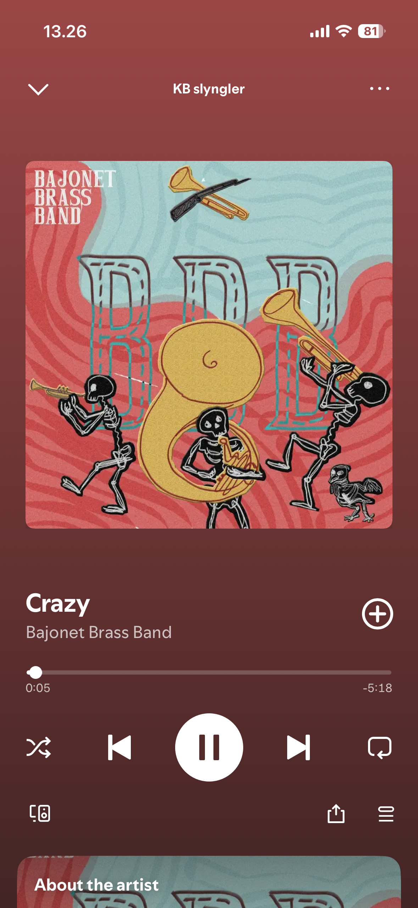

# Exercise 2

**Table of Contents**

- [Part 1](#part-1)
    - [Finishing the design we did together in class](#finishing-the-design-we-did-together-in-class)
        - [Optional: Additional questions](#optional-additional-questions)
- [Part 2](#part-2)
    - [Recreate a "Now Playing" screen from Spotify](#recreate-a-now-playing-screen-from-spotify)
- [Relevant documentation](#relevant-documentation)

## Part 1

### Finishing the design we did together in class

The folder `Part 1` contains the code of what we did in class. As you know, we did not add any icons to the code.

Add the icons and try to copy the original design as much as possible.

> Remember that you can download the icons directly from Figma! Click on the Icon, and on the right panel at the bottom you will see the option `Export`

#### Optional: Additional questions

- If the profilepic.png was a high-resolution raw file (e.g., 2000x2000px) instead of a pre-sized asset, what specific **style properties** must you define to prevent it from covering the entire screen, and how do you ensure it stays a perfect circle? Try to do it!

 

- What happens if we remove the `<View>` component wrapping the `<Image>` component?

 

- By default, React Native stacks everything on top of each other like a tower of blocks. In your postHeader style, we used flexDirection: 'row'. If you deleted that one line, what would happen to the profile picture and the username?

 

## Part 2

**Do not worry if you do not get to work on this part during this exercise, it's your first day programming in React Native and things might move slowly.**

Think of this as *home*work. 

If you do manage to start already, you will have begun working on Assignment #1.

### Recreate a "Now Playing" screen from Spotify

Now it's your turn to do some designing in Figma and then code it in React Native.

Remember to try to get as much of the design as possible, however, it's ok if some things are missing or are simplified. 

A couple of things to consider:

- The background **<u>must</u> be one solid color**
- You can ignore the `About the artist` part at the bottom of the screen
- The artist and song don't have to be real :^)
- If the "progress bar" is giving you trouble, skip it or design a new one

Some questions/tips that will help you:

- Try to divide the screen into segments and think of them as `<View>`s.
    - How many `<View>`s can you see?
    - Try to create a skeleton first, for example, you can start with 3 `<Views>` called Header, Album Art, and Controls.
- The order of your components in the code is the order they appear on the screen. The first thing in your code is at the top; the last thing is at the bottom.
- Notice how the song title/album is on the left and the ⊕ icon is on the right? Which `justifyContent` property did we use in the Instagram exercise to achieve that?
- If you are struggling to see where a `<View>` starts or ends, give it a temporary `backgroundColor: 'red'` or `borderWidth: 1`. 

# Relevant documentation

- `<View>`: https://reactnative.dev/docs/view
- `<Text>`: https://reactnative.dev/docs/text
- `<Image>`: https://reactnative.dev/docs/image
- `<Style>`: https://reactnative.dev/docs/style
    - Height and Width: https://reactnative.dev/docs/height-and-width
    - Flexbox: https://reactnative.dev/docs/flexbox
