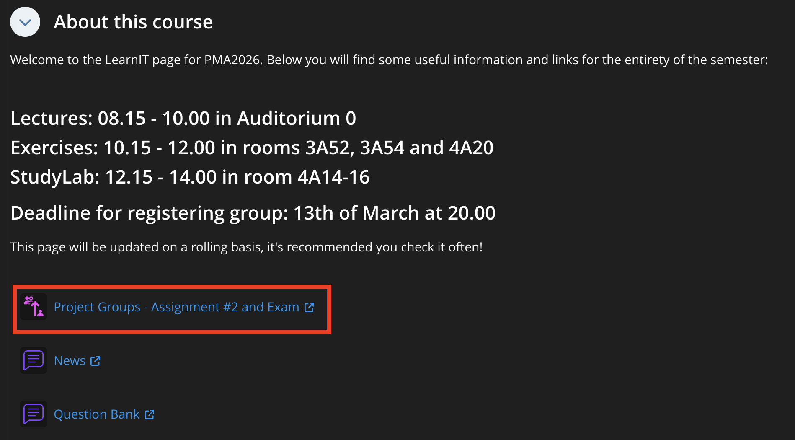
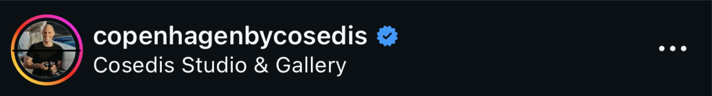
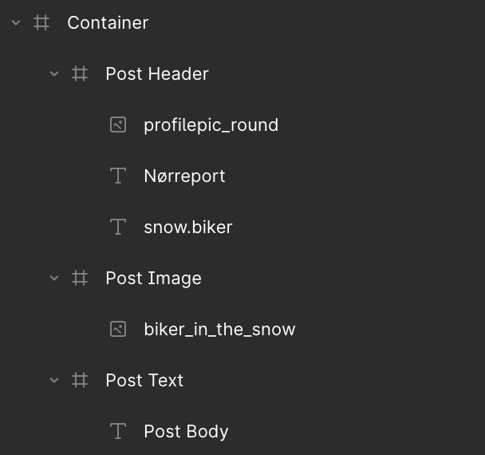

# Session 2: Designing and Coding Your First Screen 

Intro to Figma, React Native and Expo

<div class="abs-br m-6 flex gap-2">
  <a href="https://github.com/luuislanda/PMA2026" target="_blank" alt="GitHub" title="Open in GitHub"
    class="text-xl slidev-icon-btn opacity-50 !border-none !hover:text-white">
    <carbon-logo-github />
  </a>
</div>


---
layout: default
hideInToc: true
---

# Table of Contents

<Toc maxDepth="2"></Toc>

---
hideInToc: true
---

# Course Announcements

- As this is our first hands-on class, towards the end I'd like to hear from you about the pace
- Group signups for Assignment #2 and Exam are officially open, **deadline: 13th of March**

<br>



<br>

  - Register your group on LearnIT, [direct link here](https://learnit.itu.dk/mod/groupselect/view.php?id=243805&redirect=1)
  - Please avoid calling your group something like "Group 2", "2", "Group ??"
  - For any changes/modifications after the deadline, email me
  - You can also work by yourself, just register a group with 1 member.

<style>
h1 {
  text-align:center;
}
</style>


---

# Setting Up a Project

Here's how I recommend you go about starting your projects.

0. Open VSCode and click on `Open`
1. Using that navigator, create a folder for this project, we'll call it "Session 2"
2. Click on `Open` and then say you trust the authors
3. On the top menu, go to `Terminal` and then click on `New Terminal`
4. Once it's open, we can run the commands from the guide in exercise 1

`npx create-expo-app@latest --template blank .`

5. After everything is set up, run the final command:

`npm start`

6. Scan the QR code with your phone (if you haven't yet download the Expo Go App for your phone)


---
layout: center
hideInToc: true
---

# If Expo fails to connect to your phone ...

I have added a [troubleshooting document](https://github.com/luuislanda/PMA2026/tree/main/troubleshooting) to LearnIT, there you have a few options on what to do

If you are still having issues, follow the guide on how to use the web browser for now and reach out to me or the TAs for further help.

<style>
h1 {
  text-align:center;
}
</style>

---
layout: center
hideInToc: true
---

# File Structure - What are we looking at?


---

# The App.js file

```js {all|1-2|4-10|13-20|4-20|6-9}
import { StatusBar } from 'expo-status-bar';          //imports Expo related components
import { StyleSheet, Text, View } from 'react-native';          //imports React Native components

export default function App() {
  return (                  // <--- This is the functional part of the app, where the components live
    <View style={styles.container}>
      <Text>Open up App.js to start working on your app!</Text> 
      <StatusBar style="auto" />
    </View>
  );
}

const styles = StyleSheet.create({
  container: {
    flex: 1,
    backgroundColor: '#fff',      // <---- These lines are what control the look of the screen
    alignItems: 'center',
    justifyContent: 'center',
  },
});

```

---
hideInToc: true
layout: center
---

# Let's go to VSCode and change some things

<style>
h1 {
  text-align:center;
}
</style>


---
hideninToc: true
layout: center
---

Do you have some questions you'd like to ask but we are moving too fast?

[You can leave them on LearnIT's Question Bank, and I'll answer them later](https://learnit.itu.dk/mod/forum/view.php?id=243691&forceview=1)

---
layout: center
---

# Figma Design

Our coding environment is ready, but we don't know what to code yet. We're missing a design.

<p align= "center">Let's go to Figma and make a design for a screen</p>


<style>
h1 {
  text-align:center;
}
</style>

---
layout: center
---

You can find the Figma design [here](https://www.figma.com/design/LlNim7Cb7uWSph1Bk537KT/Session-2--Your-first-screen?node-id=51-13&m=dev&t=3SwJAzDKPBrcqftU-1)


---
layout: center
hideInToc: true
---

# Break!

See you in 15 minutes

<style>
h1 {
  text-align:center;
}
</style>

---

# React Native Core Components

| **Component**        | **Description**           | **Figma Counterpart**  |
| ------------- |-------------| -----|
| `<View>`     | The most fundamental RN UI Component | Frame |
| `<Text>`      | Used to display text      |   Text |
| `<Image>` | Used to displau images      |    Asset/Image |
| `<StyleSheet>` | Used to style the UI, similar syntax to CSS | Styles Panel
| `<TextInput>` | A component for inputting text into the app via keyboard | Custom Text Component
| `<ScrollView>` | A scrolling container that can host multiple components and views | Frame (with scrolling enabled in Prototyping section) |


---
layout: center
---

# Code along

Let's go over the components while we code the Figma design

<style>
h1 {
  text-align:center;
}
</style>


---
level: 2
layout: image-right
image: https://decomposition.com/cdn/shop/files/card-paper-image-spiral-blank_36c1a8af-bf0e-4ec7-8edd-c1d8467364f3.svg?v=1708620101
zoom: 0.95
---


# `<View>`

Think of it like blank page on a notebook

> [Click here to see the official documentation](https://reactnative.dev/docs/view)

- The most fundamental component for building a UI!
- View is a container that supports layout with flexbox, style, _some_ touch handling, and accessibility controls.
- View maps directly to the native view on whatever platform RN is running on, whether that is a UI View, div, android.view, etc
- View is designed to be nested inside other views and can have 0 to many children of
any type

---
hideInToc: true
level: 2
layout: two-cols-header
zoom: 0.95
---

# `<View>`

- When coding a screen, try to think of all the _"Views"_ inside it
- It's a good idea to use `<View>` often, specially if you notice that some elements are connected or go often together
- Don't be shy with your `<View>`'s. If you find that styling something is hard, try wrapping it in a `<View>`

<br>

#### Example:

- The elements of the image on the right are always together and appear the same way in all posts

- Together can be thought as a frame or `<View>` called "Post Header" or "Post Author Info"

- Here is how this `<View>`'s' structure would look like:


::left::


```js
<View style={styles.postHeader}>
  <Image/> // profile pic
  <Text></Text> //username & subtitle/location
  <Image/> //icon
</View>
```


::right::



---
level: 3
hideinToc: true
layout: two-cols
---

# Fimga ↔ React Native


::right::

<br>
<br>

```js {height:"100%""}
export default function App() {
  return (
    <View style={styles.container}>
    
      {/* Post Header */}
      <View>
        
      </View>

      {/* Post Image */}
      <View>

      </View>


      {/* Post Text */}
      <View>

      </View>


    </View>
  );
}
```


---
level: 2
zoom: 0.95
---


# `<StyleSheet>`

- The StyleSheet API in React Native is an abstraction similar to CSS StyleSheet

- **All** core React Native components accept a style prop. This prop takes a JavaScript object (or an array of objects) where the style properties are written in camelCase (e.g., backgroundColor).

- A common mistake: Creating the style object but forgetting to pass it to the component's style prop, so no styles are applied.

```js {3|10-17|3,11-16}{maxHeight:'300px'}
export default function App() {
  return (
    <View style={styles.container}>
      <Text>Open up App.js to start working on your app!</Text>
      <StatusBar style="auto" />
    </View>
  );
}

const styles = StyleSheet.create({
  container: {
    flex: 1,
    backgroundColor: '#fff',
    alignItems: 'center',
    justifyContent: 'center',
  },
});

```

---
level: 2
hideInToc: true
layout: image-right 
image: https://files.readme.io/217a128-1d55bad-flexdirection.gif
backgroundSize: 70%
---

# `<StyleSheet>`

- Styling will be where you will probably spend most of your time in this course, it's where the UI happens
- While similar to CSS in syntax, it behaves differently!
  - For example, in RN, styles are not inheritable
  - `em`, `vh` and `rem` don't work in RN
- While we will touch upon a lot of stylesheet in this course, we approach it more from a structure context.

---
level: 2
---


# `<Text>`

> [Click here to see the official documentation](https://reactnative.dev/docs/text)


- Probably the simplest component
- Can nest other `<Text>` components, here's an example:

```js {all||7-12|7-12,18-31}{maxHeight:'70%'}
import { StyleSheet, Image, Text, View } from 'react-native';

export default function App() {
  return (
    <View style={styles.container}>
      {/* Post Text */}
      <View style={styles.postBodyContainer}>
        <Text style={styles.parentText}>
          <Text style={styles.postBodyUsername}>snow.biker</Text>
          <Text style={styles.postBodyText}>On my way to work, I love it when I get to bike in the snow!</Text>
        </Text>
      </View>
    </View>
  );
}

const styles = StyleSheet.create({
  postBodyContainer: {
    margin: 20,
  },
  parentText: {
    color: 'white' //this is inherited to all the <Text> elements inside parentText
  },
  postBodyUsername: {
    fontWeight: 'bold'
  },
  postBodyText: { //this can be left blank as well :) can help in structuring code
  }
});

```

<!-- 
<Text numberOfLines={1} ellipsizeMode="tail">
  This is a very long text that will be truncated with an ellipsis...
</Text>
-->

---
level: 3
hideinToc: true
---

# Nested `<Text>` Components

- Nested `<Text>` components lose their "box" properties and behave like words in a sentence. 
  - They flow one after another horizontally and wrap as a single unit.
  - this is why you can’t use flexbox, padding, or margin on the inner elements in a nested `<Text>` component

- Unlike most components in React Native, nested `<Text>` will _*actually inherit styles*_ from its parent `<Text>` component. 
  - If you set a font size or color on the outer wrapper, all nested children will follow suit unless you specifically override them.


---
level: 2
layout: image-right
image: https://reactscript.com/wp-content/uploads/2022/05/Easy-Photo-Gallery-Component-For-React-Native.webp
backgroundSize: 60%
---

# `<Image>`

> [Click here to see the official documentation](https://reactnative.dev/docs/image)

- A React component for displaying images, including network images, static resources, temporary local images, and images from local disk, such as the camera roll.
  

- Allows us to fetch and display an image from local storage as well as one from network and even from data provided in the 'data:' uri scheme

- If the images are local, they will live in the `Assets` folder

- Can be styled to have round corners, different transparency, etc.

---
level: 3
hideInToc: true
---

# `<Image>`

- Unlike the other components we've seen `<Image>` is a [**self-closing component**](https://eslint.style/rules/jsx-self-closing-comp)
- This means that you do not need to write `<Image> </Image>`. Rather, the syntax is like this: `<Image/>`

- There are a few but in this course we won't see more than 3

- Keep this in mind to avoid some errors

<br>

Here an example of how an `<Image>` element looks like:

```js{1,6|1-6}
<Image 
  style={styles.postImage}
  source={{
    uri: 'https://upload.wikimedia.org/wikipedia/commons/5/53/Sheba1.JPG', //gets the image from the internet
  }}
/>
```


---
layout: center
hideInToc: true
---

# Questions?

<v-click> I will upload the code from this class to LearnIT </v-click>

<style>
h1 {
  text-align:center;
}
</style>

---
layout: center
---

# Next week

- Prototype interactions in Figma 
- Make the components interactive in React Native
- Explore Apple and Google's design frameworks
- Go through Assignment #1

<style>
h1 {
  text-align:center;
}
</style>


---
layout: image-right
image: ./assets/imgs/exercise_example.PNG
backgroundSize: 50%
---

# Exercise - Session 2

- **On LearnIT, you can find the detailed description for the exercise of today**
- Part 1: Finish what we did in class
- Try to only use components we've seen today
- Part 2: Start a new design. Save what you will make, because you will be able to use it for Exercise 3 and Assignment #1

<p align="center">See you next week!</p>