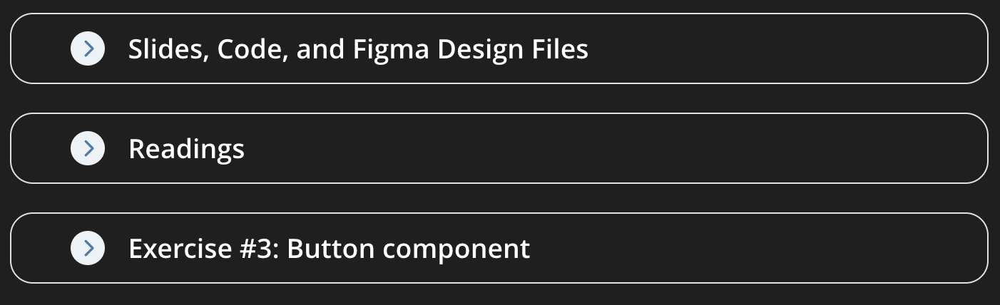

# Session 3: Re-cap and Intro to Interactive Components 

Looking back at code from Session 2 and Designing & Coding an Interactive Button 

<div class="abs-br m-6 flex gap-2">
  <a href="https://github.com/luuislanda/PMA2026" target="_blank" alt="Link to Course's Github" title="The Course's Github Repository"
    class="text-xl slidev-icon-btn opacity-50 !border-none !hover:text-white">
    <carbon-logo-github />
  </a>
</div>


---
layout: default
hideInToc: true
zoom: 1.3
---

# Table of Contents

<Toc maxDepth="2"></Toc>


---


# Course Announcements

- New LearnIT session structure:



- The session's Figma and Live-coding files will be on LearnIT at 08.00
- Added `Cheatsheet`s and `Guides` on LearnIT, at the top
- There will be extra Figma sessions for those that feel that part is going too fast
  - Dates will be announced soon, they will happen during the StudyLab
- Remember to register your group!
  - Groups can be max 4 people. It's out of my hands, sorry
  - Register the group **specially** if you are doing the assignment and exam alone, otherwise you'll miss out on supervision


---
hideInToc: true
---

## Our "Stack"

<br>

#### JavaScript

- This is the foundational language for all our tools, yes, even Figma is written in Javascript. 
- While we don't engage a lot with "pure" JavaScript, we are constantly in it's domain.

<br>

#### JSX (Syntax)

- JavaScript doesn't naturally understand `<View>` tags. JSX extends it so it can understand this sort of "grammar"
- JSX is a way for us to write "Visual Code" that looks like a UI but is actually converted into JavaScript behind the scenes 


---
hideInToc: true
---

## Our "Stack"

<br>

#### React Native

- Our main coding tool. It depends and runs on JavaScript and JSX.
- It takes your code and "maps" it to Native Code for mobile devices 
- We use it because it allows us to develop apps/prototypes that work on most mobile devices
  - For example, when you write `<View>` in your React Native app:
    - On iOS it crates a Native version of `<View>` called `UIView` (Swift)
    - On Android it does the same, and it translates to a `ViewGroup` (Kotlin)

<br>


#### Expo

- Expo is your development and testing environment
- It should make it easier to deploy and test our apps without having to worry about compilers, hosting, and other points of friction


---


# React Native Syntax

- Each `App.js` file has 3 parts:

<br>

| **Part** | **Analogy** | **Explanation** |
| ---- | ---- | ---- |
| Imports | Toolbox | Where you make sure you are bringing all the tools (components) for the job |
| The function | Tools | This is where your components go and all the logic that powers your app |
| Styles | The design | Styling is how you make you app look prett and make it look like the design you made in Figma |

<br>

All of them are interconnected


---
level: 2
hideInToc: true
zoom: 1.15

---

# Components and Syntax

- Components are the "tools" you will use to build your prototype 
- They are always **Captitalised** and sorrounded by tags "`<` `>`"
- To initialise a component we must:
    - 0. Choose a component, and make sure it's been imported
    - 1. Begin by putting the component name in tags: `<Text>`
    - 2. Specify the <Link to="9">"props"</Link> of the component `<Text style={styles.textExample}>`
    - 3. Add the content inside the tags
    - 4. Close the tags `</Text>`

 <TypedCodeBlock 
  :code="`<Text> Always remember to close your tags ;) </Text>`"
  language="javascript"
  :type-speed="120"
  :start-delay="10000"
  :showCursor="false"
/>   

<TypedCodeBlock 
  :code="`<Text style={styles.textExample}> Always remember to close your tags ;) </Text>`"
  language="javascript"
  :type-speed="120"
  :start-delay="20000"
  :showCursor="false"
/>

---
hideInToc: true
---

# Components and Syntax


- Components can exist within other components, this is called _nesting_ and the components that live inside other components are called _children_

```js
<View>    
  <Text>I am a child</Text> 
  <Image />   {/* I am also a child of <View> */}
</View>
```

- Not all components can have children though. 
- Childless components like `<Image />` have <u>self-closing</u> tags. 
  - This means that instead of writing: 

  `<Image> source={require("./assets/myimage.png")}</Image>` 
  - You write: 
  
  `<Image source={require("./assets/myimage.png")}/>`


---
hideInToc: true
layout: center
---


## Component Syntax and Children Quick Overview

|**Component**| **Style**| **Can it have Children?**|
| ---- | ---- | ---- |
|`<View>`|Open/Close | Yes |
|`<ScrollView>`|Open/Close | Yes  |
|`<Image />` | Self-closing | No |
|`<Button />` | Self-closing | No |


---
hideInToc: true
---

# A small dictionary of React Native terms

|**Term**|**What it is**|**How it looks like as code**|
| ----- | ----- | ----- |
|Component|A UI element| Always surrounded by tagss: "`<` `>`". It starts with a capital letter: `<Text>` |
|Prop(s) |A <u>property</u> of the components | Sits inside the Component, here is an example with the `style` prop `<Text style={styles.mainTitle}`> |
|Styles| The design | Usually found at the end of file, usually is declared like this: `const styles = StyleSheet.create({...})`|


---
hideInToc: true
---

# Props

- Props are **always** _**inside**_ the "`<` `>`" tags
  - For components that require opening and closing tags, props go inside the **first** pair of tags
- Some are required and some are optional 
- Not all props work the same, some expect `"simple strings"` where others need more elements
- Later on when we do custom components, you'll get to code your own prop
- If more than one, props are not separated by commas


<br>

### Example: `<Image />` Props
<br>

```js
<Image 
  source={require('./assets/logo.png')} 
  style={styles.logo} 
/>
```

---
hideInToc: true
layout: two-cols-header
---

::left::

# Props Syntax

- Props are written in "camelCase"
- Props usually expect:
  - `" "` = A String (text).

  - `{ }` = A JavaScript Expression.

  -  `{{ }}` = An Inline Object, used to pass data directly to the component. 
      - more on `{{ }}` later in the course

<!--  - We will see an application for this later in the course, but it's not part of your exam
      - Also, pls don't do this for styling! it's considered bad practice -->

::right::

<br>
<br>

```js
<Button
  title="Press to read the secret message"
  color="white"
/>
```

<br>


```js
<Image 
  source={require('./assets/logo.png')} 
  style={styles.logo} 
/>
```

<br>

 ```js
 <Text style={styles.baseText}>
  Hello, World!
</Text>
 ```


<style>
.two-cols-header {
  column-gap: 40px; /* Adjust the gap size as needed */
}
</style>

---
hideInToc: true
---

# React Native Best Practices

- Use the ["camelCase"](https://en.wikipedia.org/wiki/Camel_case) when naming your variables and objects
  - Example: use `albumCover` instead of `albumcover` or `album-cover`
- Give your styles meaningful and precise names
  - Instead of `view1` call it something related to the function it has in the app like `postTitleContainer`
- Follow the default structure of an `App.js` file:
  1. Imports
  2. Function
  3. Styling


---
hideInToc: true
layout: center
---

# React Native Best Practices

Make your code easy to read with new-lines and indentations

````md magic-move
```js
<Image source={require('./assets/logo.png')} style={styles.logo} /> //1. Add new line after component name
```
```js
<Image //2. Add new lines so every component has its own line
source={require('./assets/logo.png')} style={styles.logo} /> 
```
```js
<Image 
source={require('./assets/logo.png')} 
style={styles.logo} />
```
```js
<Image //3. Add indents using the "Tab" (⇥) key
source={require('./assets/logo.png')} 
style={styles.logo} 
/>
```
```js
<Image 
  source={require('./assets/logo.png')} 
  style={styles.logo} 
/>
```
````

---
hideInToc: true
zoom: 0.95
---

# Styles

- Styles are the properties that define the look and feel of your components
- Components have different style capabilities! Check the documentation or the [cheatsheet]
- They are initialized using a "StyleSheet" at the bottom of your file:

  0. Ensure StyleSheet is imported
  1. Create the StyleSheet at the bottom of the App.js file:
  
   `const styles = StyleSheet.create({...});`

  2. Inside the StylSheet, add your first style followed by a `{ }`: 
  
  `postHeader: { }`

  3. Add the styling and its respective value:
  
   `postHeader: { backgroundColor: "blue" }`

  4. Add a comma in the end (even if theres no more styles, its good practice)


---

The StyleSheet really benefits from using new-lines and indentations to make it readable and easy to edit.

Remember to use the camelCase! (if you're coming from CSS this is very important)

Here is how you would write one:

````md magic-move
```js
const styles = StyleSheet.create({}); //to make it readable  we add a new line between the {}
```
```js
const styles = StyleSheet.create({
  // name your first style and add it
});
```
```js
const styles = StyleSheet.create({
  postHeader: { } //to make it readable we add a new line between the {}
});
```
```js
const styles = StyleSheet.create({
  postHeader: {
    //here we add the desired styling
  }
});
```
```js
const styles = StyleSheet.create({
  postHeader: {
    backgroundColor: "blue",
  }
});
```
```js
const styles = StyleSheet.create({
  postHeader: {
    backgroundColor: "blue",
    flexDirection: "row",
    padding: 10,
  } // to add another style, we add a comma at the end of "}"
});
```
```js
const styles = StyleSheet.create({
  postHeader: {
    backgroundColor: "blue",
    flexDirection: "row",
    padding: 10,
  },
});
```
```js
const styles = StyleSheet.create({
  postHeader: {
    backgroundColor: "blue",
    flexDirection: "row",
    padding: 10,
  },
  captionText: {
    color: 'white',
    fontSize: 15,
    lineHeight: 22,
    marginBottom: 5,
  }
});
```
````

---
layout: center
---

# Recap of Session 2

## Let's go through we code we did last time

While we look at the [cheatsheet]()

<style>
h1 {
  text-align:center;
}
h2 {
  text-align:center;
}
p {
  text-align:center;
}
</style>


--- 
layout: center
---

# Assignment #1

It's already up on LearnIT, let's go through it together

<style>
h1 {
  text-align:center;
}
</style>

---
hideInToc: true
layout: center
---

# Questions?


---
hideInToc: true
layout: center
---

# Break!


---
layout: center
---

# Designing and interactive button on Figma

Follow the link to the design file on LearnIT or [click here](https://example.com)

<style>
h1 {
  text-align:center;
}
p {
  text-align:center;
}
</style>

---
hideInToc: true
layout: center
---

# Coding an interactive button in React Native


You can find the code you're about to see on LearnIT! 

<style>
h1 {
  text-align:center;
}
p {
  text-align:center;
}
</style>

---
layout: center
---

# The `<Button />` Component

- The `<Button />` is a pre-made tool for basic interactivity

- It is a **self-closing** component

---


To initialise a `<Button />` that sends the user an alert, we must:

  0. Ensure Button is imported from react-native at the top of the file

  1. Write the tag name with a capital letter: `<Button`

  2. Add the **required** title prop to define the button's text: `title="Press Me"`

  3. Add the **optional** onPress prop to define what happens when tapped: `onPress={ ... }`
    - Inside the brackets, type: `() => Alert.alert('Hello!')` <sup>1</sup> so it looks like this :

    `onPress={() => Alert.alert('Hello!')}` 

<br>
  4. Close the tag with a trailing slash: `/>`

<Footnotes separator>
  <Footnote :number=1> I know it's weird and new, we'll go over it next week!</Footnote>
</Footnotes>

---
hideInToc: true
layout: center
zoom: 1.1
---

````md magic-move
```js
import { StyleSheet, View, Button } from 'react-native'; // <-- Button has been imported

export default function App() { 
  return (
    <View style={styles.container}> 
    </View>
  );
}
```

```js
import { StyleSheet, View, Button } from 'react-native'; 

export default function App() { 
  return ( //we add a <Button /> component to our code
    <View style={styles.container}> 
      <Button /> 
    </View>
  );
}

```

```js
import { StyleSheet, View, Button } from 'react-native'; 

export default function App() { 
  return ( 
    <View style={styles.container}> 
      <Button //good idea to add a new line for readibility
      /> 
    </View>
  );
}

```

```js
import { StyleSheet, View, Button } from 'react-native';

export default function App() {
  return (
    <View style={styles.container}>
      <Button
        title="Press Me!"       // tile is the prop that manages the text inside the button
      /> 
    </View>
  );
}
```

```js
import { StyleSheet, View, Button } from 'react-native';

export default function App() {
  return (
    <View style={styles.container}>
      <Button
        title="Press Me!"       // tile is the prop that manages the text inside the button
        color="#fff"        // This controls the color of the text in iOS. In Android, it changes the background color
      /> 
    </View>
  );
}

```

```js
import { StyleSheet, View, Button } from 'react-native'; 

export default function App() {
  return (
    <View style={styles.container}>
      <Button
        title="Press Me!"      
        color="#fff"        
        onPress={}       // The onPress prop manages what will happen once the button is pressed
      />
    </View>
  );
}

```

```js
import { StyleSheet, View, Button, Alert } from 'react-native'; // We add Alert to the Imports

export default function App() {
  return (
    <View style={styles.container}>
      <Button
        title="Press Me!"      
        color="#fff"        
        onPress={() => Alert.alert('Hello!')}       // We add the logic for the alert
      />
    </View>
  );
}

```
````


---
hideInToc: true
---

# Finished Example of `<Button />`

```js {all|1,7-11|all}
import { StyleSheet, View, Button, Alert } from 'react-native'; // <-- Button and Alert have been imported

export default function App() {
  return (
    <View style={styles.container}>
      <View style={styles.buttonWrapper}>
        <Button
          title="Press Me!"       // The text inside the button
          color="#fff"        // This controls the color of the text in iOS. In Android, it changes the background color
          onPress={() => Alert.alert('Hello!')}       // This line controls what the Alert will say
        />
      </View>
    </View>
  );
}

```

---
level: 2
hideInToc: true
---

# `onPress` and `Alert`

<u>**`onPress` is a Prop**</u>
  - It listens for the exact moment a user’s finger touches and releases the component.
  - It acts as a "link" between the physical touch and the JavaScript code.

`onPress={ () => ... }`

<u>**`Alert` is a Function**</u>
  - It is a built-in tool used to pop up a message box on the user's screen.
  - It **requires** two main pieces of information: a Title and a Message.

`Alert.alert("Title", "Your message here")`

Together:

<TypedCodeBlock 
  :code='`onPress={() => Alert.alert("Title", "Your message here")}`'
  language="javascript"
  :type-speed="120"
  :start-delay="5000"
  :showCursor="false"
/>

`onPress={() => Alert.alert("Title", "Your message here")}`


---
level: 2
hideInToc: true
---

# `<Button />` props

| **Prop**     | **Purpose**                                                     | **Requirement** | **Expects** |
|----------|-------------------------------------------------------------|-------------|-------------|
| title    | The text displayed on the button.                           | Required    | String: `"Press Me!"` |
| onPress  | The function to run when tapped.                            | Required    | Function: `() => ...` |
| color    | iOS: Text color. Android: Background color. | Optional    | String: `'blue'` or Hex: `#fff` |
| disabled | Makes the button greyed out and unclickable.                | Optional    | Boolean: `"true"` or `"false"` |


---
hideInToc: true
---

# Styling a `<Button />`

- `<Button />` is a Native Component. This means its appearance is determined by the phone’s operating system (iOS or Android), not by your styles.

- You cannot pass a `style={}` prop to a `<Button />`. Trying to change its borderRadius or backgroundColor directly will simply not work.

- We can get around some of those thigns by wrapping it in a `<View>`

- The `<View>` acts as a container that you can style with margins and padding to position the button on the screen.

---
hideInToc: true
---

### Example of Styling a `<Button />` and a `<View>` wrapping the button

```js {all|3-10|16-21|3-21|all}
export default function App() {
  return (
    <View style={styles.container}>
      <View style={styles.buttonWrapper}>
        <Button
          title="Press Me!"       
          color="#fff"       
          onPress={() => Alert.alert('Hello!')}
        />
      </View>
    </View>
  );
}

const styles = StyleSheet.create({
  buttonWrapper: {    
    width: 250,
    backgroundColor: '#ff0000',   // Gives the area behind the button a color
    padding: 30,    // Gives the text "room"
    borderRadius: 50,   // Rounds the corners of the red area
  }
});
```


---
level: 2
hideInToc: true
layout: center
---

Let's add a button to the code from Session 2

---
zoom: 1.2
---

# Next Week

> **Prepare! Please watch the videos on LearnIT before coming to class.**

- Next session is a dedicated programming deep-dive into State

- We'll start from very basic programming and build up to how you can use State for interactive prototypes in React Native
  - This mean we'll go over what `() =>` is and what it does, as well as functions in general like `Alert`

- We'll introduce a new component `<Pressable>` and a revisit `onPress`

- We'll also introduce at `useState` which is a special JavaScript function that allows us to manage States


---
layout: image-right
image: https://i.imgflip.com/3eu62b.jpg
backgroundSize: "70%"
---

# Exercise 3

You'll do:

1. A few small exercises to practice using the `<Button />` component
2. Use the rest of the time for your Assignment #1

_3. Optional: A sneak peek into state using `<Button />`_

#### Rooms:

- 3A52
- 3A54
