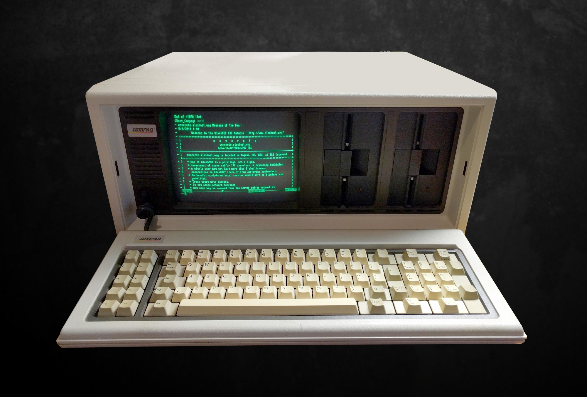

# Session 5: Accesibility in Mobile Applications Design

Making your prototypes accesibility compliant, and introducing Custom Components

  <a href="https://github.com/luuislanda/PMA2026" target="_blank" alt="GitHub" title="Open in GitHub"
    class="text-xl slidev-icon-btn opacity-50 !border-none !hover:text-white">
    <carbon-logo-github />
  </a>

---
layout: default
hideInToc: true
---

# Table of Contents

<Toc maxDepth="2"></Toc>

---

# Course Announcements

- Added instructions on how to share a Figma design file to the assignment brief
  - How is the assignment going?
  - If you are having any issues with the assignment, please email me and we can figure things out :)
- Next week, on the 13th, is the deadline for registering groups, better get to it!
- I got permission to share _some_ of the code from previous year's exam, they will be released on the 9th session
- Still waiting for a guest lecturer to accept my invite, in case this doesn't happen, we can do a re-cap session 
- Expo updated their software...

---

# Expo Update...

What happened?

- Expo released a new version of their SDK (Software Development Kit).
- They have updated their toolkit, but not their app (yet)
- When you start a new project, and you use the commands in the guides, this will lead you to receive a message along the lines of
  - `This version is not compatible` or `Please update your Expo Go App`
- Instead of that command, please use the following command (also on LearnIT)

`npx create-expo-app --template blank@sdk-54 .`

Afterards, run `npm start` and you should be good to go.

---

# Accesibility in Tech

Back in someone's day, all computers were just terminals

---

Now most computers are phones, and they have increasingly complex UIs...

---
layout: center
hideInToc: true
---

### So, why should we care about mobile applications accessibility?

Take 2 minutes and write down what device you last used to:

- Make a payment (water, electricity, heating, whatever)
- Sign an important document
- Do a "big" purchase (>3000kr)
- Book an appointment with the doctor
- Show the prescription for medicine at the pharmacy
- Show a digital identification

<!-- Inclusive design, is fundamentally, good design -->

---
hideInToc: true
---

##  Accesibility in Tech
| **Theory**                     | **Concept**                                                                                                                         | **Common Critiques**                                                                                                                                         |
|----------------------------|---------------------------------------------------------------------------------------------------------------------------------|---------------------------------------------------------------------------------------------------------------------------------------------------|
| Universal Design           | Creating products usable by all people without adaptation.                                                                      | Criticized as unattainable in practice.                                 |
| Inclusive Design           | Designing for a diverse range of human capabilities, prioritizing those with temporary, situational, or permanent disabilities. | Can be too superficial, usually made by engineers and not involving people with disabilities |
| Accessibility First        | Integrating accessibility requirements from the project's inception.                                                            | Requires significant cultural shift and resources within organizations.                                 |
| Crip Time                  | Designing for different paces of interaction, challenging normative productivity standards.                                     | Can be difficult to map to mainstream industry standards for software.                                 |

---
layout: image-right
image: https://media.licdn.com/dms/image/v2/D4D12AQHO-1YDfLrduA/article-cover_image-shrink_720_1280/B4DZcwbUVcGcAI-/0/1748864158083?e=2147483647&v=beta&t=GM5guLCnSIDDwXYE2-D8qpMhI_4nkzlsbPJ5oB-FlN4
backgroundSize: 100%
---

# HCI Principles for App Design

- Focus on the users and their tasks, not on the technology.
- Function first, presentation later.
- Conform to the users' view of the task.
- Keep displays simple to reduce short-term memory load.
- Accessibility: Design should be usable by all intended users in spite of handicap, or environmental conditions.

---
layout: image-right
hideInToc: true
image: ./assets/imgs/paper-example.png
backgroundSize: 100%
---

## HCI Principles for App Design

- Visibility: The first step to achieve a goal should be immediately clear.

- Affordance: The control should suggest how the user should use it (e.g., a button should look clickable).

- Feedback: Continually inform the user about the results of their actions and the new system state.

- Constraints: Guide the user to available actions and prevent mistakes (e.g., greyed-out options).

- Consistency: Use similar layouts and terminologies for predictability across the app.

---
layout: center
hideInToc: true
---

# Question time

Who do you think was "the user" for the example app in the paper?

<!-- 
1. Have you ever had to design software that will be used by many people?
2. Did you ever try to imagine your user? How?
-->

---
hideInToc: true
---

# Attempting to understand users

Have any of you actually done this btw?

---
layout: center
---

# When empathy goes wrong

> "Designers who use disability simulation techniques... may not need to consider the user with disabilities; instead, they may focus on their own experience..."

 

> "A range of recent scholarship has pointed to the ways empathy, and design thinking packages more generally, work as a means of convincing designers that they have superior training and ethical tools to quickly assess and innovate on problems in domains they are unfamiliar with." 1

<Footnotes separator>
  <Footnote :number=1> The Promise of Empathy: Design, Disability, and Knowing the "Other" by  Cynthia L. Bennett & Daniela K. Rosner.</Footnote>
</Footnotes>

<!-- 
The quote emphasizes that designers who rely solely on their own understanding of disability might not truly consider the needs of users with disabilities. It’s crucial to recognize that our experiences are not universal.

The call from the optional paper (which I really recommend to read if you are interested in the topic) is that need to move beyond simply thinking about users and actively engage with them.  It requires a shift in perspective, acknowledging that designing for accessibility isn't just about adding features; it’s about fundamentally rethinking the design process with inclusivity at its core.
-->

---
layout: center
---

We will watch two videos about NemID (only in Danish sorry for non-danish speakers)

We'll discuss them afterwards, 

---
layout: center
---

Video 1

<Youtube id="GfYIMxbuAN0" width="800" height="500" />

---
layout: center
---

Video 2

<Youtube id="bNX1Q6pVTik" width="800" height="500" />

---
layout: center
---

Discussion

---
layout: center
hideInToc: true
---

Break!

See you in 15 minutes

---
layout: image-right
image: https://accessibilityspark.com/wp-content/uploads/2024/10/Types-of-Assistive-technology.webp
backgroundSize: 100%
zoom: 0.95
---

# Assistive Technologies

- Assistive technology bridges the gap between user capabilities and system requirements.

- In this course, we'll mainly address visually impaired and blind users,
  - For them, effective UI/UX design must support screen readers and alternative navigation methods.

- The benefits of accessible design extend far beyond visual impairments. Elderly/seniors, non-tech-savvy people, neurodivergent individuals, and many others can significantly benefit from applications that are designed with accessibility in mind.

---
layout: center
hideInToc: true
zoom: 1.6
---

<Youtube id="EEpsoCPL518" />

[Link here](https://www.youtube.com/watch?v=EEpsoCPL518)

---

# WCAG2.1

The Web Content Accessibility Guidelines (WCAG) are a set of internationally recognized guidelines that provide a framework for making web and mobile content more accessible.

---
layout: center
hideInToc: true
---

## Web vs Mobile App Development

- Mobile app development requires a slightly different skillset and design principles compared to traditional web development.
- You are already familiar with them :^)
- A core requirement for accessible mobile apps is ensuring that the app is not only useful but also intuitive to use for people with diverse needs. 
- This often involves leveraging the specific features and APIs provided by mobile operating systems (like iOS and Android) to enhance accessibility.

--- 
hideInToc: true
---

## Compliance levels

We won't go into too much detail today, but it’s important to understand the different compliance levels within WCAG 2.1:

1. <u> **A:** This is the baseline level of accessibility.</u>
2. AA: A higher level of accessibility, addressing more potential barriers.
3. AAA: The highest level of accessibility, aiming for maximum inclusivity.

[https://www.w3.org/WAI/standards-guidelines/wcag/](https://www.w3.org/WAI/standards-guidelines/wcag/)

---
hideInToc: true
---

### WCAG2.2: Level A Compliance

Your final prototype should be compliant with the A accesibility standard, this means:

- Providing meaningful **alt text** for all images.
- Using information indicators that combine **both** color and text/symbols.
- Having **descriptive** page titles.
- Establishing a **clear heading hierarchy**.
- Ensuring **sufficient contrast** for text.   2

<Footnotes separator>
  <Footnote :number=2> This is technically an AA level compliant requirement, but an important one to already use!</Footnote>
</Footnotes>

---
layout: center
---

# Accesibility in React Native

In React Native, you can add the basic accesibility functionality via `props`

Let's download the code from LearnIT, and see how this was all implemented

---

| **Component** | **Prop Name / Attribute** | **Function / Purpose** |
| :--- | :--- | :--- |
| **`<View>`** (Header Container) | `accessibilityRole` = `"header"` | Defines the semantic role of this container, allowing screen readers to understand it as a main page header. |
| **`<View>`** (Header Container) | `accessible` = `true` | Ensures the view is included in the accessibility tree so assistive technologies can render it. |
| **`<Text>`** (Sub-Header) | `accessibilityRole` = `"header"` | Marks the sub-heading specifically, ensuring screen readers distinguish it from body text. |
| **`<Image>`** (Hero Image) | `accessibilityLabel` = "Illustration of how a screenreader will read..." | Provides a text description for the image, ensuring users who cannot see images understand what is depicted. |

---

| **Component** | **Prop Name / Attribute** | **Function / Purpose** |
| :--- | :--- | :--- |
| **`<View>`** (Status Row) | `accessibilityLabel` = "Enrollment status: ..." | Describes the entire row to screen readers, ensuring they know what information is being conveyed by the colored dot. |
| **`<TouchableOpacity>`** (Button) | `accessibilityRole` = `"button"` | Identifies the interactive element as a button, allowing screen readers to navigate it using navigation keys. |
| **`<TouchableOpacity>`** (Button) | `accessibilityHint` = "Toggles your enrollment status..." | Provides additional context or action description for the button, helping users understand what happens when it is pressed. |

---
layout: center
---

# Exercise

This exercise session you'll get to work on your assignment!

See you in rooms 3A54-56

---

# Next week

- Next week will see go back to programming
- We'll take a look at data structures, which you are familiar with now even if you are unaware 
- And we'll take a look at the following new things:
  - `<TextInput>` so you can add text to your prototypes
  - Navigation, to connect multiple screens

