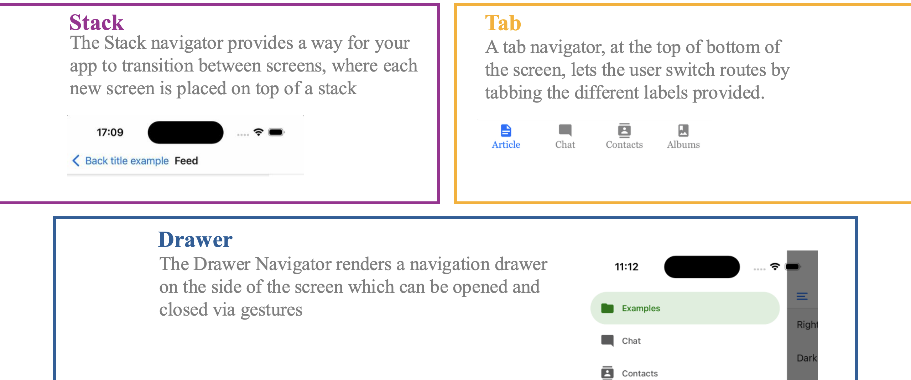
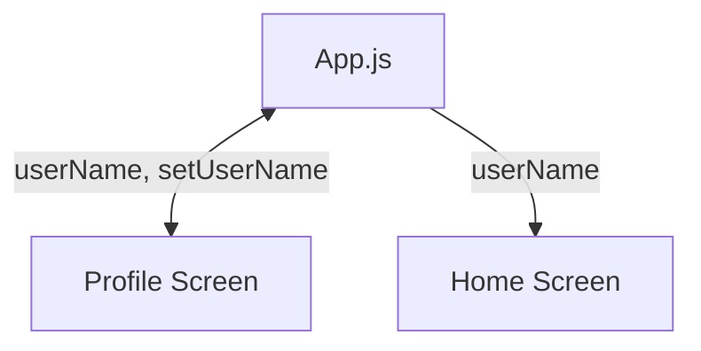

# Session 6: Data Structures, TextInput, and Navigation 

Adding more screens to your prototype

<div class="abs-br m-6 flex gap-2">
  <a href="https://github.com/luuislanda/PMA2026" target="_blank" alt="GitHub" title="Open in GitHub"
    class="text-xl slidev-icon-btn opacity-50 !border-none !hover:text-white">
    <carbon-logo-github />
  </a>
</div>


---
layout: default
hideInToc: true
---

# Table of Contents

<Toc maxDepth="2"></Toc>

---

# Course Annoucements

- Expo didn't update their app, so I will change all our guides and use SDK 54
- Most of you submitted Assignment #1, well done! :)
- It will take me a bit to go through all your submissions, but expect within the next 4 weeks
- Last days to sign up for a group! Remember this group is for Assignment #2 and the Exam
- Also remember to register as a group even if you are doing this alone
- Next week, I'll show you Assignment #2
- Because of the amount of time it takes to code things, we'll be doing very little with Figma in the coming sessions


---

# StudyLab Announcement

There is a Figma Workshop run by Louise today, it will be recorded if you cannot come ;)

It will cover:
- Frames 
- Auto Layout
- Variables
- States and Animations (Prototyping) 
- (Consisting of 2-3 screens total)


---
hideInToc: true
---

# Course Check-in

- Submitting assignment 1 is a big milestone! Congrats :)
- Don't downplay your progress, for most of you, a few weeks ago you probably couldn't program something like you've done now
- Including this session, we have 3 more technical sessions
    - After those sessions, the technical requirements for the exam will not change
    - You will only be examined on what we will see until those weeks
    - Afterwards the course will change to give space to revise things and explore things you find useful or interesting


---

# Data Structures

Data structures are specific formats for organizing, managing, and storing data to enable efficient access and modification. They transition from individual data points to logical groupings, optimizing how a computer processes information.

Each data structure has their use and their advantages and disadvantages. In this course, we mainly care about two data structures:

1. Arrays
2. Objects

---
level: 2
layout: image-right
image: https://media.geeksforgeeks.org/wp-content/uploads/20220721080308/array.png
backgroundSize: 100%
zoom: 0.9
---

## Arrays

An array is like a numbered list. It stores variables in a specific order, and each variable is assigned a numerical address called an index.

- Logic: Ordered sequence.

- How to find data: You use the position number (e.g., "Give me the 3rd item").

- Best for: Lists where the order matters, such as a high-score leaderboard or a shopping list.

- Other examples:
    - Tab bar items
    - Menu lists
    - A list of products from an API

---
hideInToc: true
---


### Important to remember

Arrays, and all data structures that have an index have their first index position at `0`.

This is just how it is! Even ITU's auditoriums index starts with 0

#### A few examples for JavaScript

```js {monaco-run} {autorun:false, height: '200px'}

const pages = ["Home", "Profile", "Settings"]

const menu = ["Pizza", "Burger", "Sodavand"]

const productsOnSale = ["Catnip", "Scratch pad", "Salmon flavoured treats"]

console.log(pages[0])
```


---
level: 2
layout: image-right
image: https://cdn-wordpress-info.futurelearn.com/info/wp-content/uploads/FL-Prog103-2.3-Dictionary-768x317.png
backgroundSize: 100%
---

## Objects

An object, sometimes called a dictionary, is like a labeled folder or phone book. It stores data in key-value pairs. Instead of using a number to find data, you use a descriptive label.

- Logic: Labeled connections.
- How to find data: You use the specific name of the key (e.g., "Give me the 'email' value").
- Best for: Representing data with different properties, like a user profile or a product's details.
- Other examples:
    - The weather data from DMI
    - The styles of your apps

---

### You've been using objects all this time...

#### An examples you are very familiar with by now

```js {monaco-run} {autorun:false, height: '300px'}

const styles = {
    container: {
        flex: 1,
        flexDirection: "row"
    }
    header: {
        fontSize: 40,
        fontWeight: 700
    },
}

console.log(styles.header)
```


---
hideInToc: true
---

## JSON

Even though we won’t write JSON in class, it’s critical for your future as a designer working with apps.

JSON or JavaScript Object Notation, is a file format that is extremely common in industry and also for hobbyist. If you want to obtain data from any source, like DMI, Rejsekort, Spotify, etc, they will give you the data in a JSON or similar format.

```js
{
    "username": "luil",
    "role": "teacher",
    "profilePicture": "",
    "lastLogIn": "7 days ago",
}
```

---

# Navigation

React Native, and all mobile frameworks, provide a variety of navigation options. 



For your prototypes, I recommend focusing on the following:

---
layout: image-right
image: https://media.geeksforgeeks.org/wp-content/uploads/20250708173723170760/push232.webp
backgroundSize: 100%
---

## Stack Navigation

- Each new screen is stacked on top of the previous one like a deck of cards.
- When you navigate to a new screen, a new card is placed on top of the stack, and when you
navigate back, the top card is removed, revealing the previous screen.
- This navigation pattern is common in many application. It allows users to drill down into
detailed views and then retrace their steps when done.
- It’s particularly useful in scenarios where a linear flow of screens is required.

---
layout: two-cols-header
---

::left::

## Bottom Tab Navigation

- Industry standard and intuitive for most mobile app users
- Great way to get an overview of how the app is structures, serves as a skeleton
- When you navigate to a screen, the bottom bar remains in place.
- Provides visual feedback to the user as to where they are
- Most bottom bars will not have more than 4 screens

::right::

<SlidevVideo autoplay controls width="280">
  <source src="https://reactnavigation.org/assets/7.x/bottom-tabs.mp4" type="video/mp4" />
</SlidevVideo>

<style>
.two-cols-header {
  column-gap: 80px; /* Adjust the gap size as needed */
}
</style>


---
layout: center
hideInToc: true
---


## Screens

So far we have only made applications with one screen. Today we will begin to work with more screens.

This raises the complexity a little bit from the code side, but most importantly, it requires us to first think and design the UX of our application.

<style>
h2 {
    text-align: center
}
</style>


---
layout: center
---

## Planning the application

Using pen and paper:

0. Sketch your application in its entirety
    - How many screens are there?
    - Can you categorise them into 4 (max) categories to put in the bottom tab?
1. Think and sketch about how the user will navigate to each of the screens
2. Sketch the UI of your screens
    - Remember to break it into components, which then become React Native components
    - Pay attention to the interactive components
3. Think about the interactivity of your app
    - If a user changes something in the settings screen, should it have an effect in another screen?
    - How are screens dependent on the data/variables from other screens?


---
layout: center
---

Beginner Tip: Start with a static app with many screens, once you have all screens and navigation is working like you want it. Begin the process of making your application dynamic

---
hideInToc: true
---

### Installing packages

---
layout: center
---

Let's make two screens and see how far we get before the break!

You can find the code already in LearnIT, it may differ a bit as always :)


---
layout: center
---

Break!

---

# `<TextInput>`

- As the name implies, this component allows the user to input some text.
- It cannot have children.
- This component has to be paired with a useState declaration.

Example:

```js
<TextInput
        style={styles.profileInput}
        placeholder='Type the name of your pet here'
        value={catName}
        onChangeText={setcatName}
        accessibilityRole="text"
        accessibilityLabel="Cat name input"
        accessibilityHint="Double tap to edit. Type your cat’s name.
/>
```

---
zoom: 0.92
---

| **Prop**           | **Description**                                                             | **Data Type**               |
|--------------------|-------------------------------------------------------------------------|-------------------------|
| style              | Applies visual formatting like margins, colors, and fonts.              | Object (StyleSheet)     |
| placeholder        | Displays temporary grayed-out text before the user starts typing.       | String                  |
| value              | The current text being displayed in the input field.                    | String (State variable) |
| onChangeText       | A callback that fires every time the user types or deletes a character. | Function                |
| accessibilityRole  | Tells screen readers the purpose of the element.                        | String                  |
| accessibilityLabel | A clear description of the input for users with visual impairments.     | String                  |
| accessibilityHint  | Provides additional guidance on how to interact with the element.       | String                  |


---

# Planning interactivity and scopes across screens

When your app has multiple screens, it's best practice to have all the logic and moving parts in the `App.js` file and leave the screens to only display the result of the logic

This is also because screens cannot really "talk" to each other, they only talk to the `App.js` file. So, in this course, we always must design with this in consideration.


---
layout: center
---




In this example: 
- The Profile Screen, communicates two variables back and forth to `App.js` (notice the arrow pointing two directions)
- The Home Screen, only receives one variable

<style>
.mermaid {
    align-self: center
}
</style>


---

# Live Coding

Let's take the static we made and add a interactive component to it via `<TextInput>`


---

# Next week

- Next week we'll take a look at custom components
- We will also continue a bit on navigation
- We will introduce the `<TouchableOpacity>` and `<ScrollView>` component
- Show and discuss Assignment #2


---
layout: center
---

# Exercises

- During the exercises you will continue working on the pet/cat app we just coded
- There are 2 exercises to practice `<TextInput>` and also how States travel across screens

<style>
    h1 {
        text-align: center
    }
</style>

---

# StudyLab

Dont forget there is a Figma Workshop later today!

- Frames 
- Auto Layout
- Variables
- States and Animations (Prototyping) 
- (Consisting of 2-3 screens total)