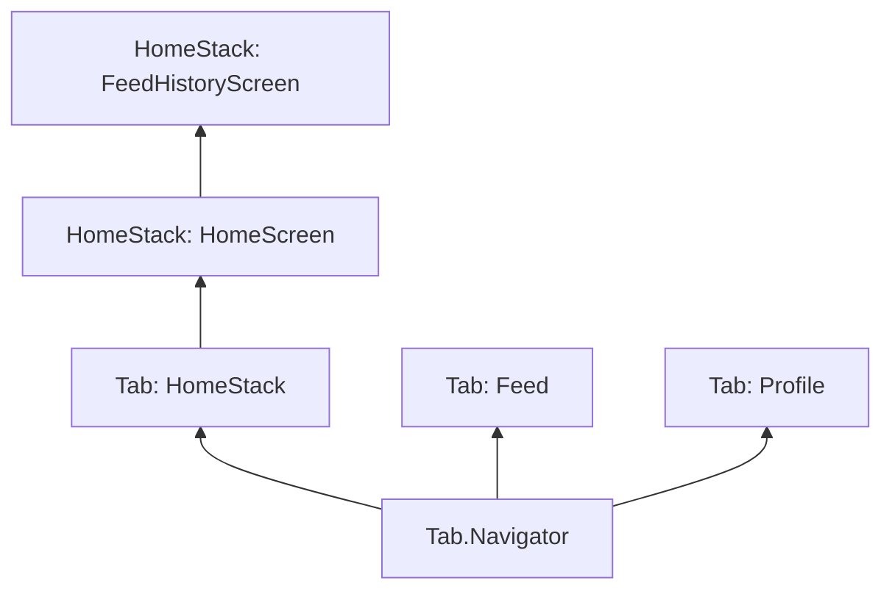

# Session 7: Stack Navigation, useNavigation and (maybe) Custom Components

Assignment #2, adding stack navigation to your prototype, and if we have time revisiting custom components

<div class="abs-br m-6 flex gap-2">
  <a href="https://github.com/luuislanda/PMA2026" target="_blank" alt="GitHub" title="Open in GitHub"
    class="text-xl slidev-icon-btn opacity-50 !border-none !hover:text-white">
    <carbon-logo-github />
  </a>
</div>


---
layout: default
hideInToc: true
---

# Table of Contents

<Toc maxDepth="1"></Toc>


---

# Course Announcements

- The cheatsheet has been updated, check it out on LearnIT
- Guides have been updated so all commands use SDK 54
- Sorry if responding slower than the usual, but I will help you as soon as I can
- I am a bit busy with another project for the DASYA Lab until the 29th of March, so I ask for a bit of patience for your feedback for Assignment #1
- What I seen so far looks good though!
- Also I have noticed that some people have used ChatGPT/Claude/LLMs to write parts of the code, that is ok, just bear in mind of ITU guidelines when using it for the exam

---
layout: center
---


# Assignment #2

The assignment is now on LearnIT, but before we take a look at it, let me explain to you why Assignment 2 is important.

<style>
  h1 {
    text-align: center;
  }
</style>

---
hideInToc: true
layout: center
zoom: 1.1
---

# Assignment #2 and your Exam


- You can think of Assignment #2 as a "mini exam"
- Assignment #2's is a group assignment that can be used as base for your exam submission.
- This is specially true of the code!
- The technical requirements of the exam will not be much more complex than Assignment #2.
- You will get a chance to get one-on-one feedback regarding your submission for Assignment #2. Use this opportunity to ask questions about the exam as well

---
hideInToc: true
layout: center
---

# Assignment #2

Let's go through the assignment together

<style>
  h1 {
    text-align: center;
  }
</style>

---
hideInToc: true
layout: center
---

Question time

<style>
  p {
    text-align: center;
  }
</style>

---
layout: center
---

# Back to the Cat Feeder App

Let's continue on the application we built last week. To this code with 2 screens I want to add the following:

- A screen where the user can add data every time they have fed their cat
- A screen where all the data is shown, and the user can click and see the information about that specific time the cat was fed

The code I am about to modify is called `Session 7 - Starting Code`. You can download it on LearnIT or you can copy the code from the `.js` files [from the github repository](*)

The `starting code` already has a new _static_ page for the feeding function. Let's take a quick look

<style>
  h1 {
    text-align: center;
  }
</style>

---
layout: center
---


I want add screen where all the feedings appear to my Home screen. 

Because I want it to be part of my Home screen, I need to use `StackNavigation`. 

<style>
  p {
    text-align: center;
  }
</style>


---
layout: image-right
image: https://media.geeksforgeeks.org/wp-content/uploads/20250708173723170760/push232.webp
backgroundSize: 120%
---

# Planning Stack Navigation

- The `NativeStackNavigator` is initialised inside the `App.js` file
- Though it is initialised there, the screens inside the `NativeStack`can only be acceses within the base screen
- This is different from `BottomTabNavigator` which exists _across_ all our screens
- Because of this, it's recommended that stack navigation generally follows the logic of the screen in which it has been initialised

---
hideInToc: true
layout: center
---

Our HomeStack will look like this:


---
hideInToc: true
layout: center
---

# Planning Stack Navigation


Our full app **navigation** will look like this:



---
layout: center
---

Now let's quickly sketch our screen. 

I will use the board but you are welcome to use Figma or any tool to do it

<style>
  p {
    text-align: center
  }
</style>


---
layout: center
hideInToc: true
---


# Installing the NativeStackNavigator

We also have to install a package to use StackNavigation. The complete set of commands is:

`npm install @react-navigation/native`

`npx expo install react-native-screens react-native-safe-area-context`

`npm install @react-navigation/native-stack`

`npm install @react-navigation/bottom-tabs`

<style>
  h1 {
    text-align: center
  }
</style>

---
layout: image-right
image: https://oss.callstack.com/react-native-paper/screenshots/react-navigation-appBar2.gif
backgroundSize: 50%
zoom: 0.95
---


# Implementing Stack Navigation

Stack navigation exists _within_ screens, what we do is turning those single screens into stacks with as many screens as we want

Similar to the `BottomTabNavigator` we first initialise our stack as a variable in our `App.js` file

```js
import { createNativeStackNavigator } from '@react-navigation/native-stack';
const HomeStack = createNativeStackNavigator();
```

Then, to make it easier to edit and to organise multiple stacks, we wrap the logic of our stack into a **function**

```js
function HomeStackScreen() {
  return (
    // logic goes here
  )

```

---

And this is what the code will look like for our home stack (as a static page)

```js {1|3|5,22|6,12|6-10|12-21|all}
const HomeStack = createNativeStackNavigator();

function HomeStackScreen() { //remember the function name for the next slide ;)
  return (
    <HomeStack.Navigator>
      <HomeStack.Screen
        name="HomeMain"
        component={HomeScreen}
        options={{ title: 'Home', headerShown: false }}
      />

      <HomeStack.Screen
        name="History"
        component={HistoryScreen}
        options={{ 
          title: 'Feeding History', 
          headerShown: true, 
          presentation: "modal", 
          animation: "slide_from_bottom"
        }}
      />
    </HomeStack.Navigator>
  );
}
```
---

Once the `HomeStack` function is made, we can now pass it to the `BottomTabNavigator` and tell it to render the stack of screens instead of a single screen.

```js {all|8}
export default function App() {

  return (
      <NavigationContainer>
        <Tab.Navigator>
          <Tab.Screen 
            name="Home" 
            component={HomeStackScreen} // Before the Stack this was component={HomeScreen}
            options={{ title: 'Home', tabBarIcon: () => <Text>🏠</Text> }}
          />
          <Tab.Screen 
            name="Feed" 
            component={FeedScreen}
            options={{ title: 'Feed Log', tabBarIcon: () => <Text>📝</Text> }}
          />
          <Tab.Screen 
            name="Profile" 
            component={ProfileScreen}
            options={{ title: 'Profile', tabBarIcon: () => <Text>🐈</Text> }}
          />
        </Tab.Navigator>
      </NavigationContainer>
  );
}
```

---
layout: image-right
image: https://habrastorage.org/getpro/habr/upload_files/3ec/d4e/912/3ecd4e9126604c45ea40093a1f3e376d.gif
backgroundSize: 50%
---


# `<ScrollView>`

To showcase the history of the times the cat was fed, we will need something that can be scrolled. 

For this we can use the `<ScrollView>` component.

Like the name implies, `<ScrollView>` functions exactly the same as a `<View>` but adding the ability to scroll.

It is good for <u>**prototypes**</u> and for when you want to showcase a non-huge number of data/options.  

Let's use it for the screen we just made

---
hideInToc: true
---

### `<ScrollView>` props

| Prop                  | Purpose                                                    | Requirement | Expects               |
|-----------------------|------------------------------------------------------------|-------------|-----------------------|
| style                 | Controls layout, spacing, and background of the container. | Optional    | Object: styles.name   |
| contentContainerStyle | Styles applied to the inner scroll content wrapper.        | Optional    | Object: styles.name   |
| horizontal            | Enables horizontal scrolling instead of vertical.          | Optional    | Boolean: true / false |
| accessibilityLabel    | A description of the scroll area read aloud by screen readers.                                       | Optional    | String: ""            |


---
layout: center
---

Now let's add a button to our normal homescreen, so we can navigate to this new screen.


---
layout: image-right
image: https://www.codevscolor.com/ca6485d991adff26ddb8e5db68e481d3/react-native-touchablehighlight.gif
backgroundSize: 50%
---


# `<TouchableOpacity>`

`<TouchableOppacity>` is extremely similar to `<Pressable>`, with the main added benefit that it includes an animation every time the user presses the component.

- It is particularly useful for buttons, and any other actions that the user should get feedback on
- It makes the styling of the feedback easier than `<Pressable>` and `<Button>`

---

---

# `useNavigation`

The `useNavigation` function allows us to give any of our interactive components **inside our screens** the ability to navigate to _anywhere_ in the app.

> It's like a navigation app. Depending on your location, it can tell you how to navigate to where you want to.

It's a very useful tool to add extra navigation prompts/options to the user depending on the context.

As it is meant for Screens, we add it to the screen `.js` file <u>**NOT**</u> the `App.js` file

To use it, we first import it, in this case I import it to my `HomeScreen.js` file:

```js
import { useNavigation } from '@react-navigation/native';
```

Then you initialise it:

```js
  const navigation = useNavigation();
```

And now it's ready to be used!

---
layout: center
---

Break, see you in 15 minutes


---
layout: image-left
image: https://64.media.tumblr.com/c096d6aa254f5f6e439ea43d515868b0/tumblr_p0etyvS8ZI1sq42p4o1_1280.png
backgroundSize: 50%
---

The example above is mainly to show you that a `Stack` is used in the same way a `Screen` is used. 

You can think of the `HomeStackScreen` function as two kids in one big trenchcoat. 

Once we want the screens to share data, things will look a bit different.

Let's make our screens share data now, and see how it changes

---

# `useNavigation`

The `useNavigation` function allows us to give any of our interactive components **inside our screens** the ability to navigate to _anywhere_ in the app.

> It's like a navigation app. Depending on your location, it can tell you how to navigate to where you want to.

It's a very useful tool to add extra navigation prompts/options to the user depending on the context.

As it is meant for Screens, we add it to the screen `.js` file <u>**NOT**</u> the `App.js` file

To use it, we first import it, in this case I import it to my `HomeScreen.js` file:

```js
import { useNavigation } from '@react-navigation/native';
```

Then you initialise it:

```js
  const navigation = useNavigation();
```

And now it's ready to be used!

---

Remember is that `useNavigation` depends on where you are! For example

### `useNavigation` from HomeScreen -> Profile

This is an example of from a main screen to another main screen

```js
<TouchableOpacity
  style={styles.historyButton}
  onPress={() => navigation.navigate('Profile')}
>
  <Text style={styles.historyButtonText}>View Profile</Text>
</TouchableOpacity>
```

---


### `useNavigation` from HomeScreen -> History

This is an example of a navigation within a stack.

In this case from the main screen "Home" to the sub-screen "History"


```js
<TouchableOpacity
  style={styles.historyButton}
  onPress={() => navigation.navigate('History')}
>
  <Text style={styles.historyButtonText}>View Feeding History</Text>
</TouchableOpacity>
```

---

When navigating from a "main" screen to another screen that is inside a stack, we need to pass a slightly different syntax

### `useNavigation` from FeedScreen -> History

```js {all|4}
<TouchableOpacity 
  style={styles.saveButton}
  onPress={() => navigation.navigate('Home', {screen: "History"})} >
  <Text style={styles.saveButtonText}>See the History</Text>
</TouchableOpacity>
```

---
layout: center
---

Now let's code this

<!-- Here I showcase how to share variables, without the button to save them all! Instead they are directly fed to the screen-->


---
layout: two-cols-header
zoom: 0.92
---

::left::

Static (no sharing of variables)

```js
function HomeStackScreen() {
  return (
    <HomeStack.Navigator>
      <HomeStack.Screen
        name="HomeMain"
        component={HomeScreen}
        options={{ title: 'Home', headerShown: false }}
      />

      <HomeStack.Screen
        name="History"
        component={HistoryScreen}
        options={{ 
          title: 'Feeding History', 
          headerShown: true, 
          presentation: "modal", 
          animation: "slide_from_bottom"
        }}
      />
    </HomeStack.Navigator>
  );
}
```

::right::

Dynamic (sharing of variables)

```js
function HomeStackScreen({ catName, personName, amountInGrams, feedNotes }) {
  return (
    <HomeStack.Navigator>
      <HomeStack.Screen
        name="HomeMain"
        options={{ title: 'Home', headerShown: false }}
      >
        {() => (
          <HomeScreen
            catName={catName}
          />
        )}
      </HomeStack.Screen>

      <HomeStack.Screen
        name="History"
        options={{ title: 'Feeding History', headerShown: true, }}
      >
        {() => <HistoryScreen 
        personName={personName} 
        amountInGrams={amountInGrams} 
        feedNotes={feedNotes} 
        /> }
      </HomeStack.Screen>
    </HomeStack.Navigator>
  );
}
```


<style>
p {
  font-size: 8pt;
  margin: -5px;
}

.two-cols-header {
  column-gap: 20px; 
}
</style>


---
layout: two-cols-header
---

Changes in the `FeedScreen.js` and `App.js` file:

Added all the variables to the function parameters

::left::

```js
export default function FeedScreen() {
  const navigation = useNavigation();
}
```

::right::

```js

export default function FeedScreen({ 
  personName, setPersonName, 
  amountInGrams, setAmountInGrams, 
  feedNotes, setfeedNotes}) {
  const navigation = useNavigation();
  }
```

<style>
.two-cols-header {
  column-gap: 20px; 
}
</style>

---
layout: center
---

If you followed up till here, amazing and well done! We achieved our objective for the day


---
layout: image-right
image: https://static.wixstatic.com/media/5d7aa2_219e32c6f3724c3d8565c5bab493d895~mv2.jpg
backgroundSize: 90%
---

# Next Week

- Next week is our mid point for the course and it's an **important** class!
- We will first finish the code of of today and finally showcase custom components
- Then we'll do a re-cap of how everything fits so far
- Then, we will do a "alignment" of our expectations for:
  - The exam
  - The rest of the semester


---
hideInToc: true
---

# Alignment of expectations for the exam

What do I mean by this?

I will show the draft of the exam brief, containing:

- The technical requirements for the exam
- The design requirements for the exam
- The accesibility requirments for the exam
- The description of the written reports

I will explain why the exam has that shape, then, you get a chance to voice any concerns or doubts you might have.

We will discuss it with everyone, trying to align as much as we can what we saw in class, the legal requirements set by the ILOs, and your grasp on many of these topics.


---
hideInToc: true
---

# Alignment of expectations for the rest of the semester

Except for one session where we will look at App Onboarding, the rest of the semester's classes will not show anything "new" or add anything to the requirements of the Exam.

I will present to you the plan for the rest of the classes,you can already see it in LearnIT ;)

We will do another Menti to see what you would like to do/see/re-cap during these lessons. Some examples of what we will/could see:

- Planning the development of a mobile application (Session 10)
- Using 'AI' to program mobile applications (Session 11)
- Figma clickable prototypes
- How to showcase your prototype in your portfolio
- Next steps: How should I continue if programming mobile applications interests me?
- Re-cap of anything related to React Native


---
layout: center
---

# Exercises Session 7

For this exercise, we continue on the cat app and you get 3-4 exercises to apply everything we learnt in class today.

Check out the link on LearnIT or [by clicling here](https://github.com/luuislanda/PMA2026/blob/main/sessions/session07/exercise/description.md)


---
layout: center
---

# If we have time...

---
layout: two-cols-header
level: 2
---

# Dealing with more than one datapoint: Data Structures Re-cap
 
### Objects

So our prototype currently can handle only one of these entries.

To expand it so it can handle many, we need to take a look back at the data structures we saw last week.

Remember that _Objects_ are very good for showing _key-Value_ pairs, if we use it to structure our data we could endup with an object like this:

::left::

Directly with data:

```js
const feedEntry = {
      personName: "Luis",
      amount: 50,
      notes: "A few meows here and there",
    }
```

::right::

Using the variables in the code:


```js
const feedEntry = {
      personName: personName,
      amount: amountInGrams,
      notes: notes,
    }
```

<style>
.two-cols-header {
  column-gap: 20px; 
}
</style>


---
layout: two-cols-header
level: 2
---

### Arrays

Also remember that _Arrays_ are good for showcasing data when the order of the data matters.

So we can organise our feedEntries into an _Array_ that we want to look like this:

::left::

With the data

```js
const feedEntriesList = [
  {
    personName: "Luis",
    amount: 50,
    notes: "A few meows here and there",
  },
  {
    personName: "Luis",
    amount: 20,
    notes: "Treat after playing",
  }
]
```


::right::

With variables

```js
const feedEntriesList = [
  feedEntry, //let's call this one feedEntry 1
  feedEntry, //and this one FeedEntry 2
]
```

<style>
.two-cols-header {
  column-gap: 20px; /* Adjust the gap size as needed */
}
</style>


---
layout: center
level: 2

---

However, we have a little problem. `FeedEntry` gets modified every time we write something in the `<TextInput>`, meaning we cannot really have more than one entry at the time with our current code.

To solve this problem we can take advantage of data structures' inner logic and structure to organise our data.

Let's look at a JavaScript example of what this will look like before we make it in React Native

---
zoom: 0.9
---

```js {monaco-run} {autorun: false}
// 1. Initialize an empty array (our data store)
var feedHistory = []; //because React Native loves consts, this will be a const there this is just an example!

// 2. This function takes "entry" and "adds" it to the beginning of the feedHistory Array
function addFeedEntry(entry) {
  feedHistory = [entry, ...feedHistory];
}

// Add first entry
addFeedEntry({ personName: "Luis", amount: 20, notes: "Breakfast" });
// Add second entry
//addFeedEntry({ personName: "Sarah", amount: 15, notes: "Lunch" });
// Add third entry
//const feedEntryExample = { personName: "Luis", amount: 30, notes: "Dinner" };
//addFeedEntry(feedEntryExample)

console.log(feedHistory);
```

---
level: 2
---

# Rethinking how data travels across screens

What if instead of sending each variable, we put all the variables inside an object, and we send that object?

Our current layout with the button can be repurporsed so that:

0. The user fills in the details
1. The user presses the "Save" button
2. The user input is put into an object
3. The object is added to the feedHistory array

---
level: 2
---

# Mapping the contents of our object to the UI

Remember the `map` function from Programming Experimental Interactions?

We are going to use it to fill our UI with the contents of our object.

```js
export default function HistoryScreen({ feedEntries }) {
  return (
    <ScrollView style={styles.container} contentContainerStyle={styles.content}>
      <Text style={styles.title}>Feeding History</Text>
        <View style={styles.listWrapper}>
          {feedEntries.map((item, index) => (
            <View key={index} style={styles.card}>
              <Text style={styles.mainText}>Fed by: {item.personName}</Text>
              <Text style={styles.subText}>Amount: {item.amount} grams</Text>
              <Text style={styles.subText}>Notes: {item.notes || 'No remarks'}</Text>
            </View>
          ))}
        </View>
    </ScrollView>
  );
}
```


---
level: 2
---

# Custom Components

Now that is a lot of code that maybe we want to re-use for another time. Here is where Custom Components come in.

We can take the code above, and add it to its own file called `FeedEntryCard.js` and there write the basic abstract version of the component:

```js
import { View, Text, StyleSheet } from 'react-native';

export default function FeedEntryCard({ item }) {
  return (
    <View style={styles.card}>
      <Text style={styles.mainText}>Fed by: {item.personName}</Text>
      <Text style={styles.subText}>Amount: {item.amount} grams</Text>
      <Text style={styles.subText}>Notes: {item.notes || 'No remarks'}</Text>
    </View>
  );
}
```

---

