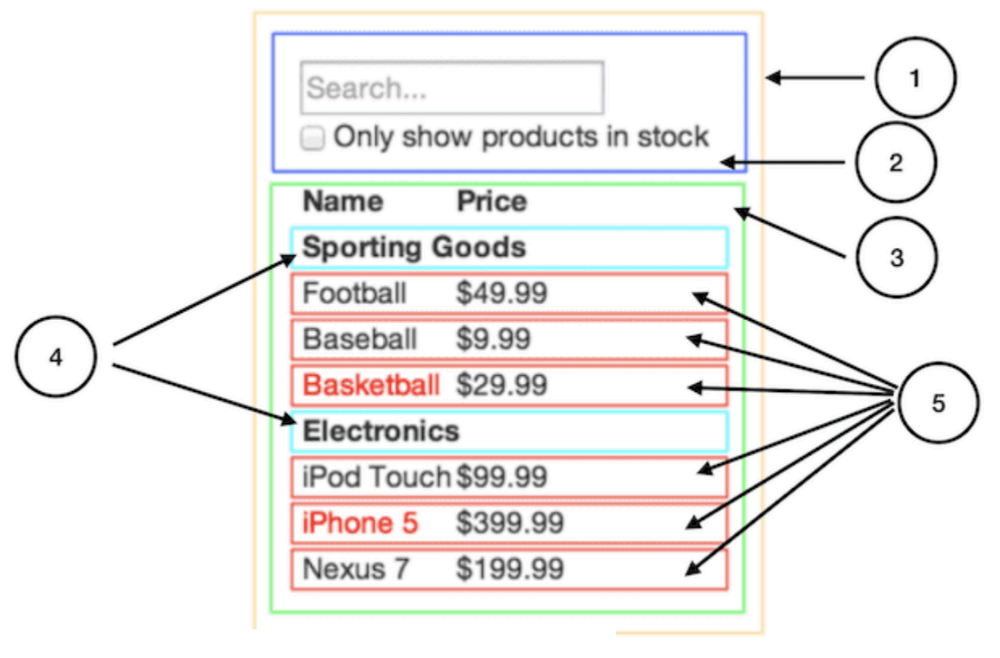
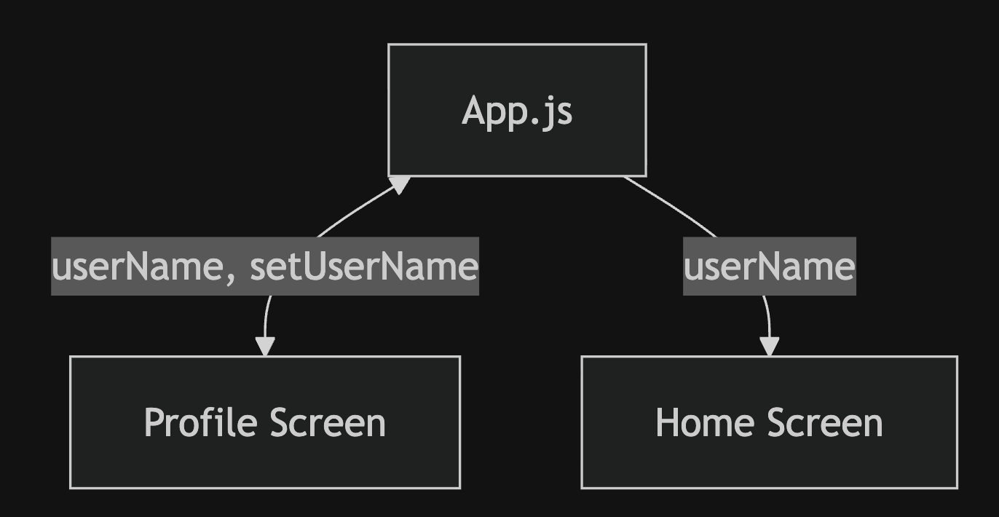

# Session 8 Exercise: From App Idea to Exam-Ready Prototype Plan

## Purpose of this exercise

1. Clarify your app idea so it matches the exam scope.
2. Sketch and structure screens before coding.
3. Break screens into components and decide parent/child relationships.
4. Decide where state should live and how data moves across screens.
5. Validate your plan against the exam minimum requirements.

## Prototype Planning

Work in your exam group (or individually if working solo). Keep notes in one shared document, they will be useful for your exam.

Suggested timing:

1. Step 1 (idea + reality check): 10-15 min
2. Step 2 (screen sketching): 15 min
3. Step 3 (component hierarchy): 15 min
4. Step 4 (state + data flow): 10 min
5. Step 5 (exam alignment checklist): 10-15 min

## Step 1: Idea and reality check

Write a short app concept in 3-5 lines:

- What is the app for?
- Who is it for?
- What is the one most important interaction?

Then run this reality check related to your exam:

- Can this become 5 app screens + 3 onboarding screens?
- Did you consider this app will have BottomTabNavigation at all times?
- Can we meet accessibility requirements (labels, roles, contrast, not color-only)?

If you answered "no" to several questions, reduce scope now.

## Step 2: Sketch the UI(s)

Individually, create quick sketches first. You can use pen and paper, or figma, whatever you prefer for this step. 

After you are done, discuss your sketches with your group.

Required output:

- A sketch for at least 5 app screens
- A sketch for 3 onboarding screens
- Basic navigation arrows between screens
- Mark where the core interaction starts and ends

Do not over-focus on visual polish. Focus on structure and interaction clarity.

## Step 3: Break UI into component hierarchy

For each app screen:

1. Circle or mark separate UI areas as components.
2. Name each component (example: `EntryCard`, `AddEntryForm`, `Header`, `PrimaryButton`).
3. Build a parent/child hierarchy.

Ask:

- Which components are reusable?
- Which components only exist on one screen?
- Which component receives data via props?

### Example

You'll see here that we have five components in our app. We've italicized the data each component represents. The numbers in the image correspond to the numbers below.
1. `FilterableProductTable` (orange): contains the entirety of the example
2. `SearchBar` (blue): receives all user input
3. `ProductTable` (green): displays and filters the data collection based on user input
4. `ProductCategoryRow` (turquoise): displays a heading for each category
5. `ProductRow` (red): displays a row for each product 

## Step 4: Decide what data is shared and where

List your main pieces of data (example: entries, selected item, item added to basket, profile name).

For each piece of data, decide:

- Which screens/components showcase this data?
- What is the relation between this screen and the data?
    - For example:
        - Data point: Username
        - Screens:
            - Profile Screen: The user can set and change their username
            - Home Screen: The user's username is displayed in the title

Minimum requirement reminder: your prototype must share data across at least two screens.

A good idea is to sketch a diagram of all the screens of your app and how these will share data (or not). It also helps for navigation!

### Example

This diagram showcases how the data for `userName` and `setUserName` is shared across the Profile and Home screen.

You can see that the Profile Screen can change the username variable via the `setUserName` setter function. And that the Home Screen can only read the data in the `userName` variable.

## Step 5: Exam alignment checklist

Before coding, validate your plan against the draft exam brief.

### Technical structure

- [ ] 5 app screens planned
- [ ] 3 onboarding screens planned
- [ ] Bottom Tab Navigator as main navigation
- [ ] Native Stack flow inside at least one area
- [ ] Data shared across at least two screens

### Required React Native usage

- [ ] `View`
- [ ] `Text`
- [ ] `Image`
- [ ] `StyleSheet`
- [ ] `useState`
- [ ] `useNavigation`
- [ ] `Pressable`
- [ ] `TouchableOpacity`
- [ ] `TextInput`
