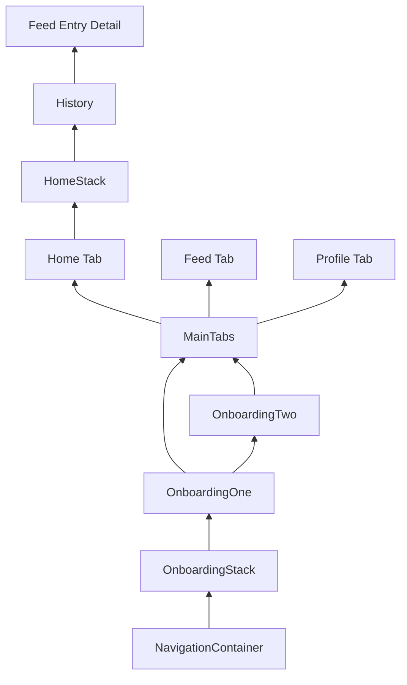
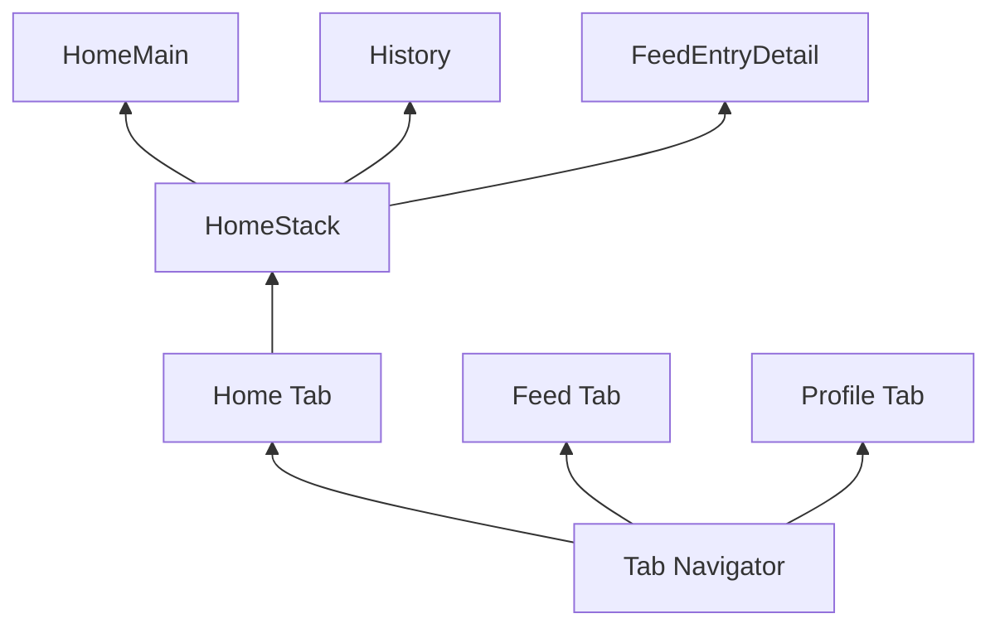

# Session 9: Onboarding Screens and Re-cap of Navigation


<div class="abs-br m-6 flex gap-2">
  <a href="https://github.com/luuislanda/PMA2026" target="_blank" alt="GitHub" title="Open in GitHub"
    class="text-xl slidev-icon-btn opacity-50 !border-none !hover:text-white">
    <carbon-logo-github />
  </a>
</div>


---
layout: default
hideInToc: true
---

# Table of Contents

<Toc maxDepth="2"></Toc>


---

# Course Announcements

- I've updated the exam description! But I am still missing some things
- I have sent most of the feedback for assignment 1
- The rest is coming today and tomorrow
- This session the last technical requirement for the course

---
layout: center
---

# Where we are now

Today we finish the aspect of Navigation and we start an important part of prototyping.

So far we have seen:

- Multiple screens
- Bottom tab navigation
- Stack navigation
- Sharing data across screens

Today we add the last new navigation concept: onboarding.

<style>
h1 {
  text-align: center;
}
p {
  text-align: center;
}
</style>


---
hideInToc: true
layout: center
---

# Why onboarding matters

- A good onboarding flow explains what the app is for
- It helps the user understand the first action they should take
- It can make a simple prototype feel much more intentional
- It is also useful in the exam because it helps communicate your concept quickly

If your app idea is not instantly obvious, onboarding can do a lot of the explanatory work for you.

Alternatively, if your app is quite specialised or has "high stakes", a guiding hand is nice for the user.


---
hideInToc: true
---

# What onboarding is not

- It is not supposed to be a wall of text/information
- It is not about covering every single function in your app
- It does not need to be fancy to be effective

For us, onboarding is simply: short, clear screens shown first that explain the app and let the user enter the main app.

Of course you can try to play around with the format if you so wish, though staying safe will always pay off!


---
hideInToc: true
---

# Exam Requirement Re-cap

For the current implementation we are aiming for the simplest version of the requirement:

- `2 onboarding screens`
- They appear first when the app runs
- They explain the logic of the app and how to use it
- They include a `Skip` button to go straight to the app

This is enough to satisfy the onboarding part without overcomplicating your code.


---
layout: center
---

# Research on onboarding

This week's paper is called: "Generating Mobile Application Onboarding Insights Through Minimalist Instruction"

Its main argument is: onboarding should not just dump information on the user, it should help them act, understand, and progress.


---
hideInToc: true
---

The paper researched onboarding for an **educational badging mobile application**.

Purpose of that app:

- Help students understand levels of competence in a topic
- Show badges connected to learning progress
- Guide users into challenges such as quizzes, writing assignments, and video reflections

So the onboarding use case was: helping new student users understand a learning-oriented app during their first use.

---
hideInToc: true
---

The paper suggests that effective onboarding should:

- Help users make progress early
- Use real and meaningful tasks, not abstract explanations
- Keep instructions brief and connected to the current screen
- Prevent common mistakes and support recovery when users get confused
- Support the user's first session, not try to explain the whole app at once


---
hideInToc: true
---

# What this means for your prototype

If we translate that research into our exam context:

- Screen 1 should explain the app clearly and quickly
- Screen 2 should point toward the first useful action in the app
- You will likely need a Screen 3 to elaborate on the action, depends on the app you are making though...
- Your wording should be short, plain, and specific
- The goal is to welcome and to direct


---
layout: center
---

# How are we implementing Onboarding Screens

Case: Cat App

Think of your app in two big categories:

1. The app itself
2. The onboarding

We will leave what we have of the app, and create a new Stack for the onboarding. To this stack, we will add two screens.

Then, we will specify the navigation structure to explicitly say the app begins with the two onboarding screens.

---
layout: center
zoom: 0.9
---

# Navigation plan




---
backgroundSize: 95%
zoom: 0.9
---

# Planning the onboarding content

Here is a suggested breakdown of what each screen can do in a 2-screen onboarding:

Screen 1:
- What is this app?
- Who is it for?
- Why should the user care?

Screen 2:
- What should the user do first?
- What is the main interaction?
- What button takes them into the app?


---
layout: image-left
image: ./assets/imgs/IMG_0715.PNG
backgroundSize: 50%
---

# Onboarding Screen 1

This first screen usually introduces the concept of the app.

Example structure:

- Image or illustration
- A short title
- One or two lines of explanation
- `Skip` in the corner
- `Next` as the main action


---
hideInToc: true
zoom: 0.9
---

```jsx
import { Image, Pressable, StyleSheet, Text, TouchableOpacity, View } from 'react-native';
import { useNavigation } from '@react-navigation/native';

export default function OnboardingOne() {
  const navigation = useNavigation();

  return (
    <View style={styles.container}>
      <TouchableOpacity
        style={styles.skipButton}
        onPress={() => navigation.replace('MainTabs')}
      >
        <Text style={styles.skipText}>Skip</Text>
      </TouchableOpacity>

      <Image source={{ uri: 'https://images.pexels.com/photos/1056251/pexels-photo-1056251.jpeg' }} style={styles.image} />

      <Text style={styles.title}>Welcome</Text>
      <Text style={styles.description}>
        Explain what your app does and why users should care.
      </Text>

      <Pressable
        style={styles.button}
        onPress={() => navigation.navigate('OnboardingTwo')}
      >
        <Text style={styles.buttonText}>Next</Text>
      </Pressable>
    </View>
  );
}
```


---
layout: image-right
image: ./assets/imgs/IMG_0716.PNG
backgroundSize: 50%
---
# Onboarding Screen 2

This second screen usually explains how to use the app.

Example structure:

- Another image or visual cue
- A short explanation of the first user action
- `Skip` still available
- `Start App` as the final action


---
hideInToc: true
zoom: 0.9
---

```jsx
import { Image, Pressable, StyleSheet, Text, TouchableOpacity, View } from 'react-native';
import { useNavigation } from '@react-navigation/native';

export default function OnboardingTwo() {
  const navigation = useNavigation();

  return (
    <View style={styles.container}>
      <TouchableOpacity
        style={styles.skipButton}
        onPress={() => navigation.replace('MainTabs')}
      >
        <Text style={styles.skipText}>Skip</Text>
      </TouchableOpacity>

      <Image source={{ uri: 'https://images.pexels.com/photos/774731/pexels-photo-774731.jpeg' }} style={styles.image} />

      <Text style={styles.title}>How To Use It</Text>
      <Text style={styles.description}>
        Explain the first actions a user should take inside the app.
      </Text>

      <Pressable
        style={styles.button}
        onPress={() => navigation.replace('MainTabs')}
      >
        <Text style={styles.buttonText}>Start App</Text>
      </Pressable>
    </View>
  );
}
```


---
layout: image-right
image: https://www.justpaintball.co.uk/cdn/shop/products/bcMJnwP.png
backgroundSize: 60%
zoom: 0.95
---

# What is this `replace()` line?

Notice that the `Skip` and `Start App` buttons use:

```js
navigation.replace('MainTabs')
```

This is the way to make user "jump" to the `MainTabs` which are the screens that make up our app


---

# Integrating onboarding into `App.js`

Importing the screens we just made:

```jsx
import OnboardingOne from './screens/onboarding/OnboardingOne';
import OnboardingTwo from './screens/onboarding/OnboardingTwo';
```

Create the onboarding stack:

```jsx
const OnboardingStack = createNativeStackNavigator();
```

Then we explicitly write the order of the screens. To do this, we can copy this to the `App` function:

---
hideInToc: true
zoom: 0.9
---

```jsx
return (
  <NavigationContainer>
    <OnboardingStack.Navigator
      initialRouteName="OnboardingOne"
      screenOptions={{ headerShown: false }}
    >
      <OnboardingStack.Screen name="OnboardingOne" component={OnboardingOne} />
      <OnboardingStack.Screen name="OnboardingTwo" component={OnboardingTwo} />
      <OnboardingStack.Screen name="MainTabs">
        {() => (
          <MainTabs
            catName={catName}
            setCatName={setCatName}
            feedEntries={feedEntries}
            addFeedEntry={addFeedEntry}
          />
        )}
      </OnboardingStack.Screen>
    </OnboardingStack.Navigator>
  </NavigationContainer>
);
```


---
layout: center
---

Break!

---

# Navigation recap - No code just theory with a bit of code :)

Let's restart navigation from zero, then climb back up to `NativeStackNavigator`.


---
hideInToc: true
---

# What navigation does in your prototype

Without navigation, your app is just one long static view.

Navigation gives your prototype:

1. Multiple screens
2. A structure users can understand
3. A way to move between related tasks

It also adds a sense of "depth" to your idea/showcase

---
hideInToc: true
---

# The 3 building blocks

Every navigation setup in this course uses the same three pieces:

1. `NavigationContainer`
2. A `Navigator` (Tab or Stack)
3. One or more `Screen` registrations

If these three pieces are clear, the rest becomes much easier.


---
hideInToc: true
---

# Step 0: Install navigation packages and create screens

Use these commands in your project:

`npm install @react-navigation/native`

`npx expo install react-native-screens react-native-safe-area-context`

`npm install @react-navigation/native-stack`

`npm install @react-navigation/bottom-tabs`

And also create your screens in the `screens` folder


---
hideInToc: true
zoom: 0.95
---

# Step 1: Wrap the app

Once we incorporate navigation, we will always "wrap" our application in a `NavigationContainer`

```jsx
import { NavigationContainer } from '@react-navigation/native';

export default function App() {
  return (
    <NavigationContainer>
      {/* Your navigators go here */}
    </NavigationContainer>
  );
}
```

Think of `NavigationContainer` as the root engine that keeps track of routes.


---
hideInToc: true
---

# Step 2: Declare the navigators

Before building the screens, declare the navigators at the top of `App.js`.

```jsx
import { createBottomTabNavigator } from '@react-navigation/bottom-tabs';
import { createNativeStackNavigator } from '@react-navigation/native-stack';

const Tab = createBottomTabNavigator();
const HomeStack = createNativeStackNavigator();
const OnboardingStack = createNativeStackNavigator();
```

Now we can build the app in the same order as the final example.


---
hideInToc: true
---

# Step 3: Build the Home stack first

This is the first deeper flow in the app.

```jsx
function HomeStackScreen({ catName, feedEntries }) {
  return (
    <HomeStack.Navigator>
      <HomeStack.Screen
        name="HomeMain"
        options={{ title: 'Home', headerShown: false }}
      >
        {() => <HomeScreen catName={catName} />}
      </HomeStack.Screen>

      <HomeStack.Screen
        name="History"
        options={{
          title: 'Feeding History',
          headerShown: true,
          presentation: 'modal',
          animation: 'slide_from_bottom',
        }}
      >
        {() => <HistoryScreen feedEntries={feedEntries} />}
      </HomeStack.Screen>

      <HomeStack.Screen
        name="FeedEntryDetail"
        component={FeedEntryDetailScreen}
        options={{ title: 'Entry Detail', headerShown: true }}
      />
    </HomeStack.Navigator>
  );
}
```


---
layout: image-right
image: https://media.geeksforgeeks.org/wp-content/uploads/20250708173723170760/push232.webp
backgroundSize: 110%
hideInToc: true
---

# Why start with the Home stack?

Remember that while stacks are many screens together, they only have one "address" in our navigation.

In this case, since it's our home screen it will be the first thing the user sees. So it makes sense to start with it.

A stack works like cards in a deck:

- New screen: push one card on top
- Back action: remove top card

In this example, the deeper flow is:

`HomeMain -> History -> FeedEntryDetail`


---
hideInToc: true
---

# Step 4: Build `MainTabs`

Now place that stack inside the `Home` tab, and keep the other tabs as regular screens.

```jsx
function MainTabs({ catName, setCatName, feedEntries, addFeedEntry }) {
  return (
    <Tab.Navigator
      initialRouteName="Home"
      screenOptions={{
        headerShown: false,
        tabBarActiveTintColor: '#B3541E',
        tabBarInactiveTintColor: '#5A5A5A',
        tabBarStyle: {
          backgroundColor: '#F7F3EB',
        },
        tabBarLabelStyle: { fontSize: 12 },
      }}
    >
      <Tab.Screen name="Home">
        {() => (
          <HomeStackScreen
            catName={catName}
            feedEntries={feedEntries}
          />
        )}
      </Tab.Screen>

      <Tab.Screen name="Feed">
        {() => (
          <FeedScreen
            addFeedEntry={addFeedEntry}
            catName={catName}
          />
        )}
      </Tab.Screen>

      <Tab.Screen name="Profile">
        {() => (
          <ProfileScreen
            catName={catName}
            setCatName={setCatName}
          />
        )}
      </Tab.Screen>
    </Tab.Navigator>
  );
}
```


---
zoom: 0.9
hideInToc: true
---

# Step 5: Overview so far

Now the app has two levels of navigation:

- Tabs for the overall app
- Stack for one deeper flow




---
hideInToc: true
---

# Step 6: Navigate between screens

`useNavigation()` gives you access to route changes from inside a screen component.

```jsx
import { useNavigation } from '@react-navigation/native';

const navigation = useNavigation();

onPress={() => navigation.navigate('History')}
```

From a different navigator level, route syntax can change:

```js
onPress={() => navigation.navigate('Home', { screen: 'History' })}
```


---
hideInToc: true
---

# Step 7: Add onboarding on top

After tabs and stack are clear, onboarding becomes easy.

You just add one onboarding stack above everything:

1. `OnboardingOne`
2. `OnboardingTwo`
3. `MainTabs`

So the user sees onboarding first, then your existing app.


---
hideInToc: true
zoom: 0.9
---

```jsx
export default function App() {
  const [catName, setCatName] = useState('');
  const [feedEntries, setFeedEntries] = useState([]);

  const addFeedEntry = (entry) => {
    setFeedEntries((prevEntries) => [entry, ...prevEntries]);
  };

  return (
    <NavigationContainer>
      <OnboardingStack.Navigator initialRouteName="OnboardingOne" screenOptions={{ headerShown: false }}>
        <OnboardingStack.Screen name="OnboardingOne" component={OnboardingOne} />
        <OnboardingStack.Screen name="OnboardingTwo" component={OnboardingTwo} />
        <OnboardingStack.Screen name="MainTabs">
          {() => (
            <MainTabs
              catName={catName}
              setCatName={setCatName}
              feedEntries={feedEntries}
              addFeedEntry={addFeedEntry}
            />
          )}
        </OnboardingStack.Screen>
      </OnboardingStack.Navigator>
    </NavigationContainer>
  );
}
```


---

# Exercise

The main goal of today's exercise is to add onboarding to your own prototype or exam code.

If you are not ready to use your own exam code yet, use the cat feeder example first.

- Create `screens/onboarding/OnboardingOne.js`
- Create `screens/onboarding/OnboardingTwo.js`
- Add an onboarding stack navigator above your tabs
- Set `initialRouteName` to the first onboarding screen
- Add `Skip` and `Start App` navigation
- Make sure your main app still works after onboarding


---
hideInToc: true
---

# Next Week

Next week we will look at genAI and how/why/why not use when doing mobile application programming.

The weeks after that we will do recaps, once again navigation and then state.


---
layout: center
---

Bye!