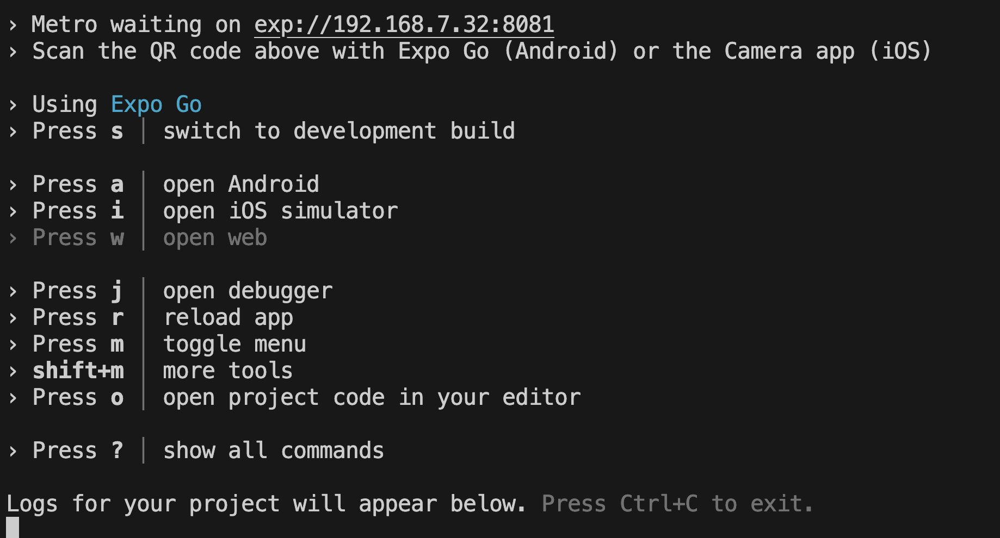
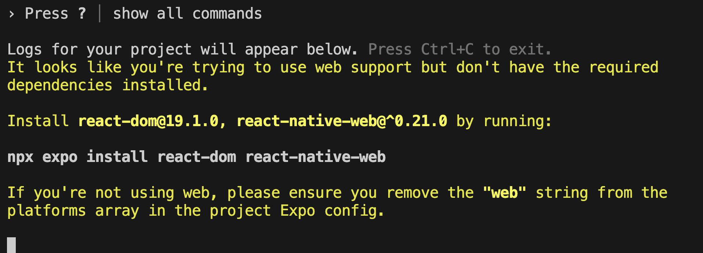
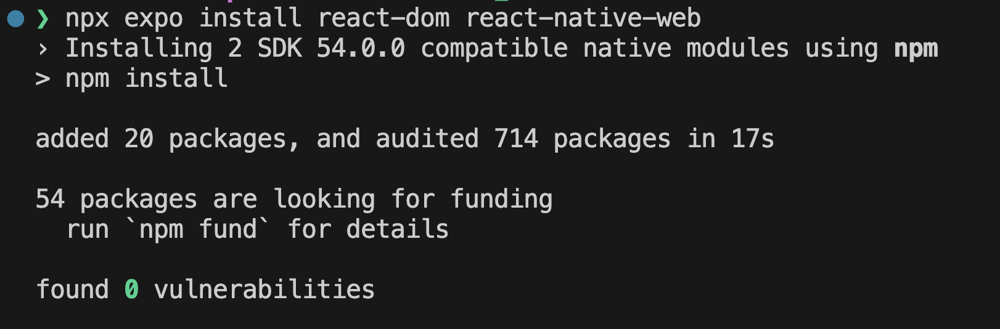
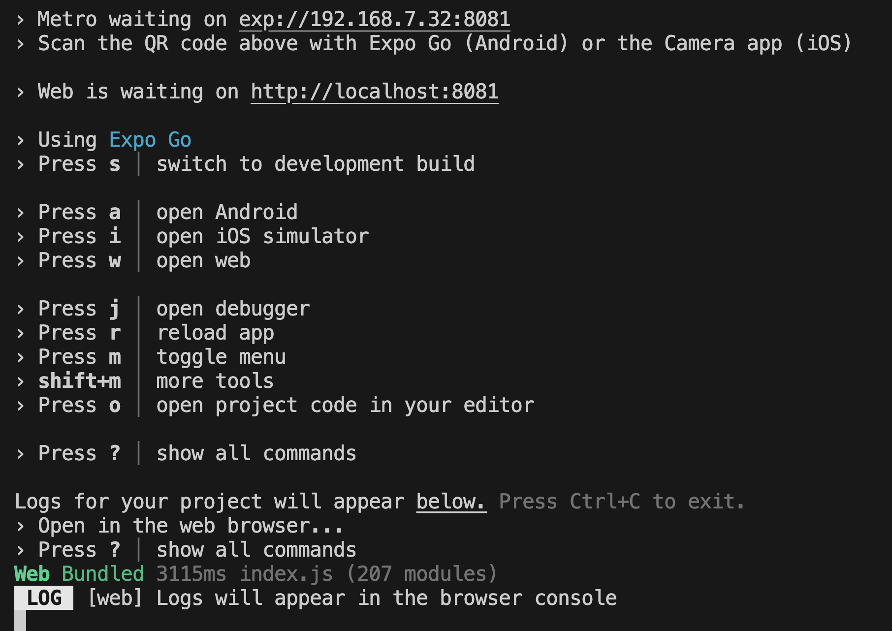
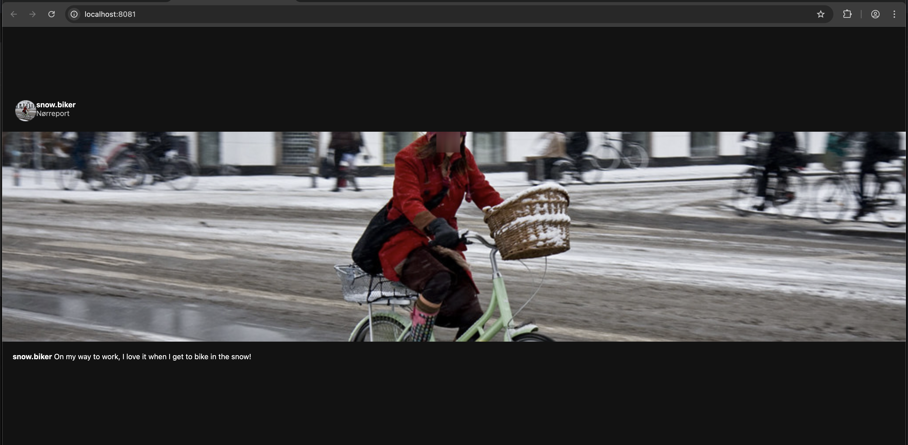
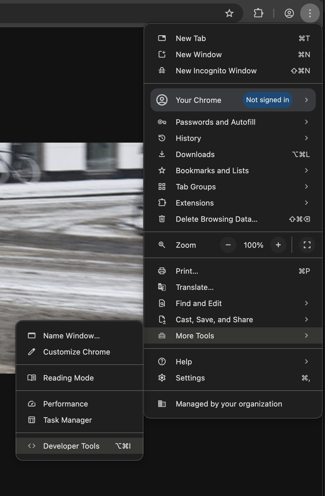
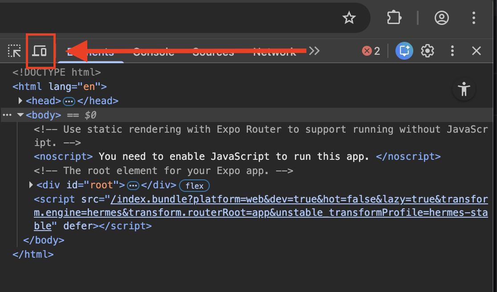
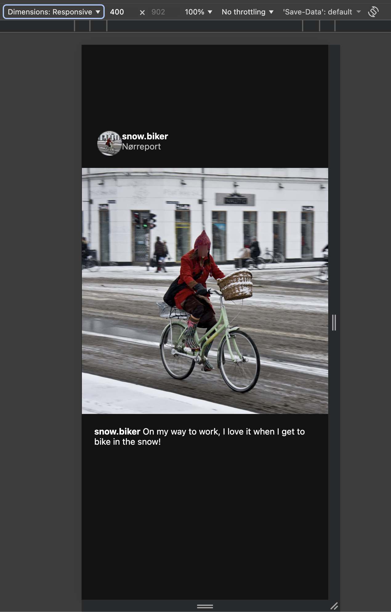

# General Troubleshooting Guide

This document will collect all advice regarding any troubleshooting we see in the course, this can include things related to Expo, VsCode, the terminal, etc.

## Expo

### My Expo app is not loading after I scan the QR code 

This is a very common issue you'll encounter, specially if you are at ITU! First make sure you go through the checklist below and if that doesn't work we can try a few things

#### Expo App QR checklist

- [ ] Check that both your phone and your computer are on the same Wifi network
    - Sometimes your phone is on `eduroam` and your computer is on `ITU++`. Before trying anything else, **make sure they are both in the same network**
    - Since ITU's networks are not always the best, you can try connecting your computer to your phone via a hotspot
- [ ] Do you have a VPN active at the moment? Turn it off while you work on your project
    - VPNs often have a feature that blocks all local network communications, meaning, it will block your phone from reaching your computer. If you really want to keep the VPN, check the settings to make sure the local network feature is turned off
- [ ] If the above don't work, restart the computer and close the app on the phone and try again, ensuring they are on the same network and the VPN (if you have it) is off.

#### Everything failed... what now?
##### Using the browser (for now)

If you are still having problems using your phone, you can follow along with the web browser. To do so, first, do the `npm start` command unti you get to this screen in the terminal:

Once here, press `w`

You will likely see this message, if not, then all good, skip to step 5! But if you do just follow the instructions:

1. On your keyboard, press `Control + C` to stop the process in the terminal
2. Run the command the terminal told you:
`npx expo install react-dom react-native-web`
3. Once you see this screen, it means its installed

4. Run `npm start` again and once ready press `w`
5. A web browser window will open, on the terminal you will see this screen:

6. All done you can start developing on the browser. Follow the instructions below to make sure the browser set up is emulating a mobile device

##### Setting up the browser for mobile development

Likely your project will look very weird once opened in the browser, this is because we are building mobile applications, not desktop webpages.

To change this, go to the Developer Settings menu like below:

Once open, click on this button:

The view will change, now it should look like this:

Here you can click on `Dimensions: Responsive` and select a device you use/like.

Now you are ready to develop, the changes will automatically appear once you save your file.